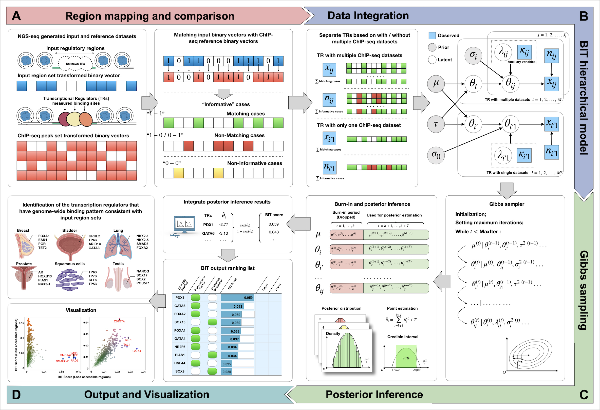

<!-- README.md is generated from README.Rmd. Please edit that file -->



<!-- badges: start -->
<!-- badges: end -->

The goal of **BIT** is to identify the transcriptional regulators that govern user-defined epigenomic regions (e.g. ATAC-seq, DNase-seq, MNase-seq), the input can be either a file that stores the information of “peaks” generated by common peak-calling algorithms (e.g. MACS2) or any specific user-defined regions, such as peaks from a differential accessibility analysis (e.g. DiffBind).

## Read the Docs documentation
We have an instruction manual on readthedocs.

[Manual](https://bitbayesian-identification-of-transcriptional-regulators.readthedocs.io/en/latest/)

## Installation

You can install the development version of BIT from
[GitHub](https://github.com/ZeyuL01/BIT) with:

``` r
# install.packages("devtools")
#devtools::install_github("ZeyuL01/BIT")
#library(BIT)
#> ℹ Loading BIT
```

If you meet a compilation problem,

For Mac users please refer to the following:
<https://thecoatlessprofessor.com/programming/cpp/r-compiler-tools-for-rcpp-on-macos/>

For Windows users please refer to the following:
<https://cran.r-project.org/bin/windows/base/howto-R-devel.html>

Or submit your questions through issues, we are happy to answer them.

## Load ChIP-seq data

Pre-compiled ChIP-seq database can be accessed through:
<[https://smu.box.com/s/mhpelp5zro7538pbfkfj65xf61842huo](https://smu.box.com/s/dswrvsz4chh7ygkjpwdq3lex2gvrz2gi)>

``` r
#Please download the chip-seq file and unzip it to a local directory.
#For example: /.../Desktop/data/ChIP-seq/macs2_peaks_inds_1000/

#The function below needs to run once to set up.

chip_path = "/.../Desktop/data/ChIP-seq/macs2_peaks_inds_1000/"
load_chip_data(chip_path, bin_width = 1000)

#> [1] "ChIP-seq data successfully loaded, please run BIT with input to check!"
#> NULL
```

## Quick start to use BIT.

It is very simple to run **BIT** as long as you have the input file with the format as one of 
bed/narrowPeak/broadPeak/bigNarrowPeak/csv.

``` r
#As an example, the user-input peak set file path is "file_path/CTCF.bed"
input_path = "file_path/CTCF.bed"
output_path = "output_path/"
input_test<-BIT(input_path, output_path)
#> [1] "Load and map peaks to bins..."
#> [1] "Done."
#> [1] "Compare the input regions with the pre-compiled reference ChIP-seq data, bin width used: 1000 bps"
#> ==================================================[1] "Done."
#> [1] "Start BIT Gibbs sampler, iterations: 5000"
#> [1] "Done."


Results_Table<-display_tables("file_path/file_name.rds","output_path")
#> Results_Table
#         TR   Theta_i     lower     upper  BIT_score BIT_score_lower BIT_score_upper Rank
#1      CTCF -2.010571 -2.011593 -2.009676 0.11809745      0.11799114      0.11819079    1
#2     RAD21 -2.028610 -2.031747 -2.025619 0.11623164      0.11590978      0.11653925    2
#3      SMC3 -2.110100 -2.120542 -2.100907 0.10811898      0.10711622      0.10900866    3
#4     SMC1A -2.181305 -2.193447 -2.170246 0.10144192      0.10034048      0.10245443    4
#5      PHF2 -2.222166 -2.633869 -1.990377 0.09777755      0.06699025      0.12021697    5
#6    GABPB1 -2.301673 -2.689461 -2.062208 0.09098450      0.06359813      0.11282466    6
#7      CHD2 -2.317842 -2.370804 -2.270597 0.08965600      0.08542628      0.09358759    7
#8      NFYA -2.353494 -2.396030 -2.313238 0.08678843      0.08347594      0.09003250    8
#9    NELFCD -2.371794 -2.476460 -2.276018 0.08534898      0.07752502      0.09312872    9
#10     NFYC -2.373795 -2.767204 -2.122314 0.08519290      0.05912233      0.10694685   10
```
