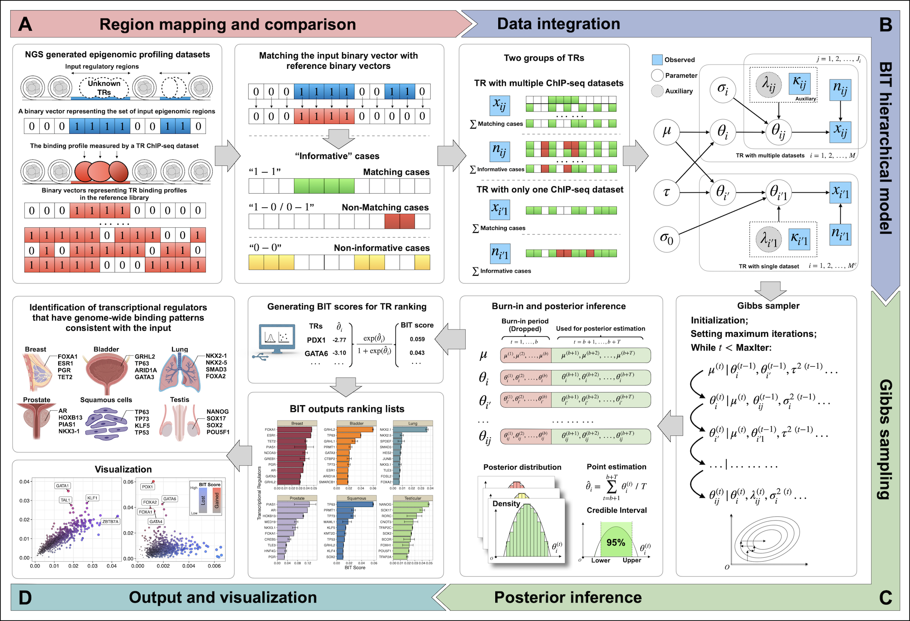

<!-- README.md is generated from README.Rmd. Please edit that file -->

<!-- badges: start -->

<!-- badges: end -->

<p align="center" width="100%">


</p>

## Bayesian Identification of Transcriptional Regulators from Epigenomics-Based Query Region Sets


**BIT** is a novel bioinformatics tool designed to identify
transcriptional regulators from a user-provided set of epigenomic
regions. These regions are typically derived from genome-wide epigenomic
profiling data that probe specific biological processes, such as
ATAC-seq. Using a pre-processed reference library containing over 10,000
human TR ChIP-seq datasets and over 5,000 mouse TR ChIP-seq datasets,
**BIT** leverages a Bayesian hierarchical model to achieve higher
accuracy and enhanced interpretability.



## Read the Docs Documentation

We have an manual on Read the Docs.

[Manual](https://bitbayesian-identification-of-transcriptional-regulators.readthedocs.io/en/latest/)

In this manual, we provide an introduction to BIT, a detailed
walkthrough of BIT's main installation and primary functions, and four
examples to reproduce figures from our manuscript.

## Reference ChIP-seq Data

We have pre-compiled 10,140 TR ChIP-seq datasets associated with 988
human TRs and 5,681 TR ChIP-seq datasets associated with 607 mouse TRs.
We also offer different bin-width options for the TR reference database
to suit user needs. These data can be downloaded from the Zenodo online
data repository:

| Bin Width | hg38 Download Link                                                                                   | mm10 Download Link                                                                                   |
|-----------|------------------------------------------------------------------------------------------------------|------------------------------------------------------------------------------------------------------|
| 1000      | [hg38_1000.tar.gz](https://zenodo.org/records/14231098/files/hg38_1000.tar.gz?download=1)              | [mm10_1000.tar.gz](https://zenodo.org/records/14231098/files/mm10_1000.tar.gz?download=1)              |
| 500       | [hg38_500.tar.gz](https://zenodo.org/records/14231098/files/hg38_500.tar.gz?download=1)                 | [mm10_500.tar.gz](https://zenodo.org/records/14231098/files/mm10_500.tar.gz?download=1)                 |
| 200       | [hg38_200.tar.gz](https://zenodo.org/records/14231098/files/hg38_200.tar.gz?download=1)                 | [mm10_200.tar.gz](https://zenodo.org/records/14231098/files/mm10_200.tar.gz?download=1)                 |

<<<<<<< Updated upstream
**Please note: BIT cannot run without the reference data, so please load the reference ChIP-seq database once BIT has been installed.**
=======

[Please note: BIT cannot run without the reference data, so please load
the reference ChIP-seq database once BIT has been
installed.]{style="color: red; font-weight: bold;"}
>>>>>>> Stashed changes

## Installation

We provide an online portal: \<[Online
Portal](http://43.135.174.109:8080/)\>

You can also install the development version of BIT from
[GitHub](https://github.com/ZeyuL01/BIT) with:

``` r
# install.packages("devtools")
#devtools::install_github("ZeyuL01/BIT")
#library(BIT)
#> ℹ Loading BIT
```

If you meet a compilation problem,

For Mac users please refer to the following:
<https://thecoatlessprofessor.com/programming/cpp/r-compiler-tools-for-rcpp-on-macos/>

For Windows users please refer to the following:
<https://cran.r-project.org/bin/windows/base/howto-R-devel.html>

Or submit your questions through issues, we are happy to answer them.

## Load ChIP-seq Data

In this example, we use a bin-width of 1000. For data with other
bin-widths, please refer to the pre-compiled ChIP-seq database available
on [Zenodo](https://zenodo.org/records/13732877).

``` r
# Download the ChIP-seq file from Zenodo and unzip it to a local directory.
# For example, unzip to: /.../Desktop/data/ChIP-seq/hg38/

# Set the path to your unzipped ChIP-seq data.
chip_path <- "/.../Desktop/data/ChIP-seq/hg38/"

# Set genome = "hg38" for hg38.zip and "mm10" for mm10.zip.
# Run the function below once to load the data.
load_chip_data(chip_path, bin_width = 1000, genome = "hg38")
```

## Quick Start to Use BIT

Running **BIT** is very simple as long as your input file is in one of
the supported formats: `bed`, `narrowPeak`, `broadPeak`,
`bigNarrowPeak`, or `csv`. Note that if your input bed file includes a
column named **"summit"**, those values will be used instead of the
region's midpoint when converting to binarized vectors.

``` r
#As an example, the user-input peak set file path is "file_path/CTCF.bed"
input_path = "file_path/CTCF.bed"
output_path = "output_path/"
BIT(input_path, output_path, N=5000, burnin=2500, genome="hg38")
#> Loading and mapping peaks to bins...
#> Done loading.
#> Comparing the input regions with the pre-compiled reference ChIP-seq data, using a bin width of 1000 bps...
#> Loading meta table...
#> Starting alignment process...
#>   |==================================================| 100%
#> Alignment complete.
#> Starting BIT Gibbs sampler with 5000 iterations...
#> 0%   10   20   30   40   50   60   70   80   90   100%
#> [----|----|----|----|----|----|----|----|----|----|
#> **************************************************|
#> Gibbs sampling completed.
#> Output data saved as output_path/CTCF.rds
#> Loading data from file...
#> Processing theta matrix and TR names...
#> Compiling results...
#> Results saved to output_path/CTCF_rank_table.csv
#> BIT process completed.


#> CTCF_results<-read.csv(paste0(output_path,"CTCF_rank_table.csv"))
#> CTCF_results
#         TR   Theta_i     lower     upper  BIT_score BIT_score_lower BIT_score_upper Rank
#1      CTCF -2.010571 -2.011593 -2.009676 0.11809745      0.11799114      0.11819079    1
#2     RAD21 -2.028610 -2.031747 -2.025619 0.11623164      0.11590978      0.11653925    2
#3      SMC3 -2.110100 -2.120542 -2.100907 0.10811898      0.10711622      0.10900866    3
#4     SMC1A -2.181305 -2.193447 -2.170246 0.10144192      0.10034048      0.10245443    4
#5      PHF2 -2.222166 -2.633869 -1.990377 0.09777755      0.06699025      0.12021697    5
#6    GABPB1 -2.301673 -2.689461 -2.062208 0.09098450      0.06359813      0.11282466    6
#7      CHD2 -2.317842 -2.370804 -2.270597 0.08965600      0.08542628      0.09358759    7
#8      NFYA -2.353494 -2.396030 -2.313238 0.08678843      0.08347594      0.09003250    8
#9    NELFCD -2.371794 -2.476460 -2.276018 0.08534898      0.07752502      0.09312872    9
#10     NFYC -2.373795 -2.767204 -2.122314 0.08519290      0.05912233      0.10694685   10
```

## Additional examples

[RUNX1 Knockout
dataset](https://bitbayesian-identification-of-transcriptional-regulators.readthedocs.io/en/latest/Examples/Examples1.html).

[scPerturbation
dataset](https://bitbayesian-identification-of-transcriptional-regulators.readthedocs.io/en/latest/Examples/Examples3.html).

[Cancer
dataset](https://bitbayesian-identification-of-transcriptional-regulators.readthedocs.io/en/latest/Examples/Examples4.html).

[PBMCs
dataset](https://bitbayesian-identification-of-transcriptional-regulators.readthedocs.io/en/latest/Examples/Examples5.html).

## Hardware Overview (Mac and HPC)

Below is an overview of the system hardware information (Personal, Macbook Pro):

| **Attribute**               | **Value**                                    |
|-----------------------------|----------------------------------------------|
| **Model Name**              | MacBook Pro                                  |
| **Model Identifier**        | MacBookPro18,3                               |
| **Model Number**            | MKGQ3LL/A                                    |
| **Chip**                    | Apple M1 Pro                                 |
| **Total Number of Cores**   | 10 (8 performance and 2 efficiency)          |
| **Memory**                  | 16 GB                                        |

For HPC information, please refer to the SMU M3 manual: [SMU M3 Manual](https://southernmethodistuniversity.github.io/hpc_docs/about.html)

## Appendix

If you use BIT in your work, please cite us!

BIT: Bayesian Identification of Transcriptional Regulators from
Epigenomics-Based Query Region Sets 

Zeyu Lu, Lin Xu, Xinlei Wang bioRxiv
2024.06.02.597061; doi: <https://doi.org/10.1101/2024.06.02.597061>

[Dr. Xinlei (Sherry)
Wang](https://www.uta.edu/academics/faculty/profile?username=wangx9)
[Dr. Lin Xu](https://qbrc.swmed.edu/labs/xulab/)
