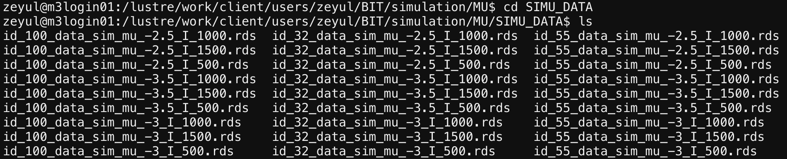
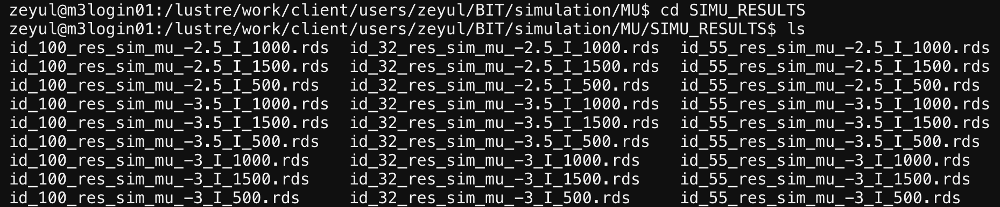
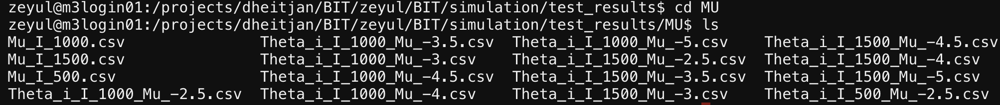
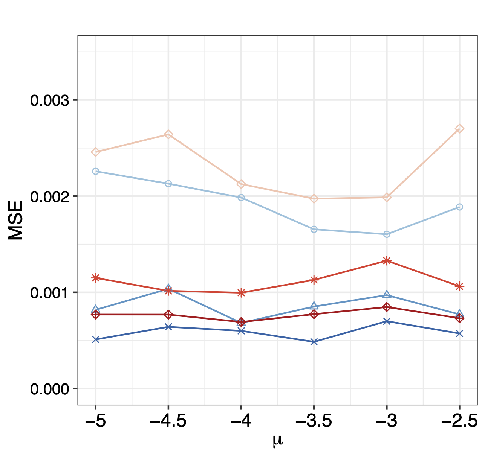
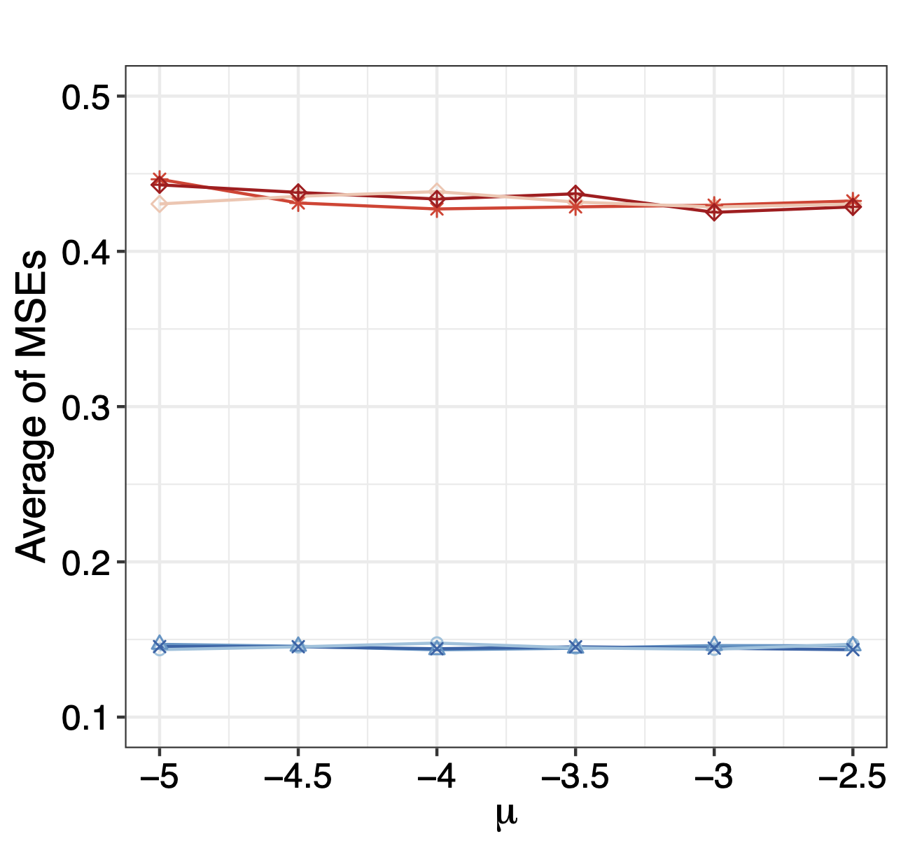
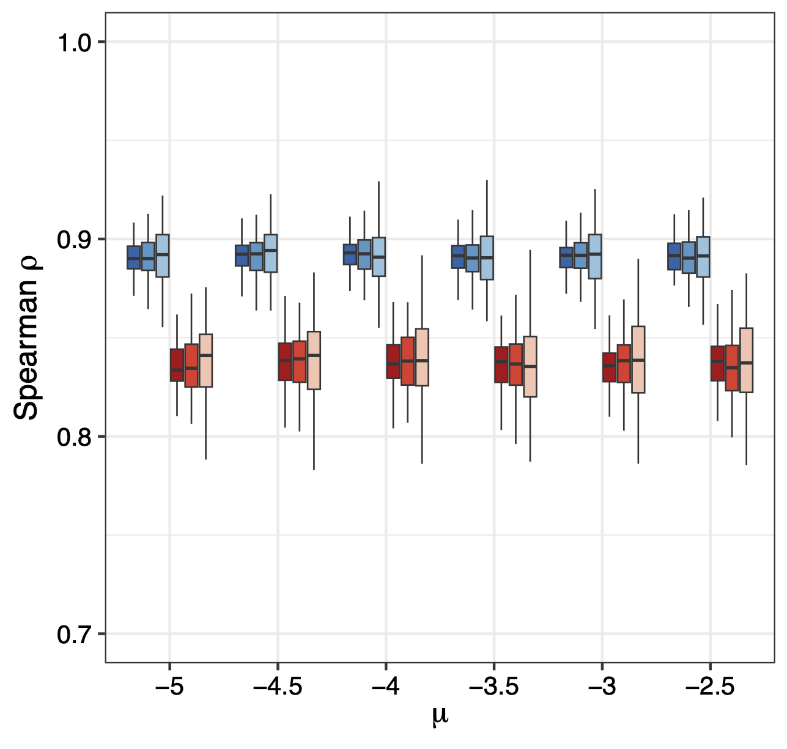

```{r setup, include=FALSE}
knitr::opts_chunk$set(echo = TRUE)
```

## Simulation

This example demonstrates how to generate simulation plots from raw data as presented in the manuscript. In manuscript, we considered three simulation cases examining $\mu$, $\tau^2$, and $\sigma_0^2$, along with two distribution variants: Gamma and Student’s $t$ distributions. Below, we focus on the case of $\mu$.

##Generating simulation data
---------------------------

To generate the raw simulation data, we run the simulation script ``SIMU_MU.R``, First, we import the required packages and configure the test values for $\mu$:


```{r, eval=FALSE}
  library(BIT)
  library(truncdist)

  # Configuration parameters ---------------------------------------------------
  TR_SIZES <- c(500, 1000, 1500)
  MU_VALUES <- c(-5, -4.5, -4, -3.5, -3, -2.5)
  TAU_SQ_VALUES <- c(0.5, 0.7, 0.9, 1.1, 1.3, 1.5)
  SIGMA0_VALUES <- c(1, 1.2, 1.4, 1.6, 1.8, 2.0)
  BASE_DIR <- "./simulation/MU"
  N_VALUE <- 30000
  ITERATIONS <- 5000
  BURN_IN <- 2500
```

Next, we define helper functions used to generate simulation data for TRs with either single or multiple observations (datasets):

```{r, eval=FALSE}
  # Helper functions --------------------------------------------------------
  logistic_transform <- function(theta) {
    exp(theta) / (1 + exp(theta))
  }

  generate_TR_size <- function(num_TRs) {
    ceiling(rtrunc(num_TRs, spec = "lnorm",
                   meanlog = 1, sdlog = 1.75,
                   a = 0, b = 1000))
  }

  generate_multi_obs_TR <- function(n, mu, tau_sq, population) {
    TR_data <- list()
    TR_data$theta_i <- rnorm(1, mu, sqrt(tau_sq))
    TR_data$sigma_i <- rgamma(1, 0.75, 100)
    TR_data$theta_ij <- rnorm(n, TR_data$theta_i, sqrt(TR_data$sigma_i))
    TR_data$x_ij <- rbinom(n, population, logistic_transform(TR_data$theta_ij))
    TR_data$n_ij <- rep(population, n)
    TR_data
  }

  generate_single_obs_TR <- function(mu, tau_sq, sigma0_sq, population) {
    TR_data <- list()
    TR_data$theta_i <- rnorm(1, mu, sqrt(tau_sq))
    TR_data$theta_ij <- rnorm(1, TR_data$theta_i, sqrt(sigma0_sq))
    TR_data$x_ij <- rbinom(1, population, logistic_transform(TR_data$theta_ij))
    TR_data$n_ij <- population
    TR_data
  }
 
  # Data generation functions -----------------------------------------------
  generate_simulation_data <- function(
      num_TRs = 1000,
      population = 30000,
      mu = -4,
      tau_sq = 0.75,
      sigma0_sq = 1.5) {

    TR_sizes <- generate_TR_size(num_TRs)

    multi_obs_count <- sum(TR_sizes > 1)
    single_obs_count <- num_TRs - multi_obs_count
    ordered_sizes <- sort(TR_sizes[TR_sizes > 1])

    simulation_data <- vector("list", num_TRs)

    # Generate multi-observation TRs
    for (i in seq_len(multi_obs_count)) {
      simulation_data[[i]] <- generate_multi_obs_TR(
        ordered_sizes[i], mu, tau_sq, population
      )
    }

    # Generate single-observation TRs
    for (j in (multi_obs_count + 1):num_TRs) {
      simulation_data[[j]] <- generate_single_obs_TR(
        mu, tau_sq, sigma0_sq, population
      )
    }

    simulation_data
  }

  structure_simulation_data <- function(raw_data) {
    structured_data <- list(
      xij = unlist(lapply(raw_data, `[[`, "x_ij")),
      nij = unlist(lapply(raw_data, `[[`, "n_ij")),
      label_vec = rep(seq_along(raw_data), lengths(lapply(raw_data, `[[`, "x_ij"))),
      theta_i = unlist(lapply(raw_data, `[[`, "theta_i")),
      theta_ij = unlist(lapply(raw_data, `[[`, "theta_ij"))
    )
    structured_data
  }
  
  # Simulation workflow ----------------------------------------------------
  run_simulation <- function(mu_value, iterations, num_TRs, simulation_id) {
    data_dir <- file.path(BASE_DIR, "SIMU_DATA")
    result_dir <- file.path(BASE_DIR, "SIMU_RESULTS")
    log_dir <- file.path(BASE_DIR, "LOG")

    dir.create(data_dir, showWarnings = FALSE, recursive = TRUE)
    dir.create(result_dir, showWarnings = FALSE, recursive = TRUE)
    dir.create(log_dir, showWarnings = FALSE, recursive = TRUE)

    # Generate and save simulation data
    simulated_data <- generate_simulation_data(
      num_TRs, N_VALUE, mu_value, 0.75, 1.5
    )
    structured_data <- structure_simulation_data(simulated_data)

    data_path <- file.path(data_dir, sprintf("id_%d_data_sim_mu_%g_I_%d.rds",
                                             simulation_id, mu_value, num_TRs))
    log_path <- file.path(log_dir, sprintf("id_%d_data_sim_mu_%g_I_%d.txt",
                                           simulation_id, mu_value, num_TRs))
    saveRDS(structured_data, data_path)

    # Run main analysis
    analysis_results <- Main_Sampling(
      iterations,
      structured_data$xij,
      structured_data$nij,
      structured_data$label_vec,
      log_path
    )

    # Process and save results
    final_results <- list(
      mu = mean(analysis_results$mu0[(iterations - BURN_IN):iterations]),
      theta_i = rowMeans(analysis_results$theta_i[, (iterations - BURN_IN):iterations]),
      label_vec = structured_data$label_vec
    )

    result_path <- file.path(result_dir, sprintf("id_%d_res_sim_mu_%g_I_%d.rds",
                                                 simulation_id, mu_value, num_TRs))
    saveRDS(final_results, result_path)
  }
```

We run the simulation 100 times for each setting, using different total numbers of TRs (500, 1000, and 1500), and varying $mu$ range from $[-5,-2.5]$, while keeping $\tau^2=0.75$ and $\sigma_0^2=1.5$ as default values.

```{r, eval=FALSE}
  # Execution block ------------------------------------------------------
  for (mu_value in MU_VALUES){
    for (sim_id in seq_len(100)) {
      for (tr_size in TR_SIZES) {
        run_simulation(
          mu_value = mu_value,
          iterations = ITERATIONS,
          num_TRs = tr_size,
          simulation_id = sim_id
        )
      }
    }
  }
```

The simulation raw data and BIT derived results will be saved as ``*.rds`` files in two separate folders: ``./simulation/MU/SIMU_DATA`` and ``./simulation/MU/SIMU_RESULTS``.

**./simulation/MU/SIMU_DATA**



**./simulation/MU/SIMU_RESULTS**



Next we need to calculate the mean squared error of $\mu$ and the Spearman $\rho$ of the estimated $\hat{\theta}_i$ with the true $\theta_i$ from the raw data:

```{r, eval=FALSE}
library(data.table)

logit_function <- function(x) {
  return(log(x / (1 - x)))
}

vec_logit <- Vectorize(logit_function)

Naive_Mu <- function(data) {
  part1 <- data$xij / data$nij
  part1[which(part1 == 0)] <- part1[which(part1 == 0)] + 0.000001
  part1 <- vec_logit(part1)
  group_means <- tapply(part1, data$label_vec, mean)
  return(mean(group_means))
}

Naive_TAU2 <- function(data) {
  part1 <- data$xij / data$nij
  part1[which(part1 == 0)] <- part1[which(part1 == 0)] + 0.000001
  part1 <- vec_logit(part1)
  return(var(part1))
}

Naive_SIGMA0 <- function(data, Mc) {
  part1 <- data$xij / data$nij
  part1[which(part1 == 0)] <- part1[which(part1 == 0)] + 0.000001
  part1 <- vec_logit(part1)
  Mu_est <- Naive_Mu(data)
  part1_Mc <- part1[(length(part1) - Mc + 1):length(part1)]
  return(sum((part1_Mc - Mu_est)^2) / (Mc - 1))
}

Naive_Theta_i <- function(data) {
  part1 <- data$xij / data$nij
  part1[which(part1 == 0)] <- part1[which(part1 == 0)] + 0.000001
  part1 <- vec_logit(part1)
  return(tapply(part1, data$label_vec, mean))
}

###################
work_dir_data <- "./simulation/MU/SIMU_DATA/"
work_dir_results <- "./simulation/MU/SIMU_RESULTS/"
output_dir <- "./simulation/RESULTS/MU/"
dir.create(output_dir, showWarnings = FALSE, recursive = TRUE)

M_vec <- c(350, 700, 1050)
Mc_vec <- c(150, 300, 450)
MU <- c(-5, -4.5, -4, -3.5, -3, -2.5)

for (i in 1:3) {
  output_mu_df <- data.frame(matrix(nrow = 6, ncol = 4))
  colnames(output_mu_df) <- c("BIT_Bias", "BIT_MSE", "Naive_Bias", "Naive_MSE")
  for (k in 1:6) {
    output_theta_i_df <- data.frame(matrix(nrow = (M_vec[i] + Mc_vec[i]), ncol = 6))
    colnames(output_theta_i_df) <- c("BIT_Bias", "BIT_MSE", "Naive_Bias", "Naive_MSE", "Naive_Spearman", "BIT_Spearman")
    
    data_files <- list.files(work_dir_data, pattern = paste0("*_mu_", MU[k], "_I_", M_vec[i] + Mc_vec[i], ".rds"))
    results_files <- list.files(work_dir_results, pattern = paste0("*_mu_", MU[k], "_I_", M_vec[i] + Mc_vec[i], ".rds"))
    
    naive_MU_vec <- c()
    naive_Theta_mat <- matrix(nrow = (M_vec[i] + Mc_vec[i]), ncol = 100)
    
    BIT_MU_vec <- c()
    BIT_Theta_mat <- matrix(nrow = (M_vec[i] + Mc_vec[i]), ncol = 100)
    
    for (m in 1:100) {
      print(paste0(i, "_", k, "_", m))
      data <- readRDS(paste0(work_dir_data, data_files[m]))
      results <- readRDS(paste0(work_dir_results, results_files[m]))
      
      label_rank <- rank(-data$theta_i)
      
      true_mu <- MU[k]
      true_Theta_i <- data$theta_i
      
      naive_Mu_val <- Naive_Mu(data)
      naive_Theta_i <- Naive_Theta_i(data)
      
      naive_rank <- rank(-naive_Theta_i)
      names(naive_rank) <- NULL
      
      BIT_Mu_val <- results$mu
      BIT_Theta_i <- results$theta_i[!duplicated(results$label_vec)]
      
      BIT_rank <- rank(-BIT_Theta_i)
      
      naive_MU_vec <- c(naive_MU_vec, naive_Mu_val - true_mu)
      BIT_MU_vec <- c(BIT_MU_vec, BIT_Mu_val - true_mu)
      
      naive_Theta_mat[, m] <- naive_Theta_i - true_Theta_i
      BIT_Theta_mat[, m] <- BIT_Theta_i - true_Theta_i
      
      spearman_naive <- cor(label_rank, naive_rank, method = "spearman")
      spearman_BIT <- cor(label_rank, BIT_rank, method = "spearman")
      
      output_theta_i_df[m, 5] <- spearman_naive
      output_theta_i_df[m, 6] <- spearman_BIT
    }
    output_mu_df[k, 1] <- mean(abs(BIT_MU_vec), na.rm = TRUE)
    output_mu_df[k, 2] <- mean(BIT_MU_vec^2, na.rm = TRUE)
    output_mu_df[k, 3] <- mean(abs(naive_MU_vec), na.rm = TRUE)
    output_mu_df[k, 4] <- mean(naive_MU_vec^2, na.rm = TRUE)
    
    output_theta_i_df[, 1] <- rowMeans(abs(BIT_Theta_mat), na.rm = TRUE)
    output_theta_i_df[, 2] <- rowMeans(BIT_Theta_mat^2, na.rm = TRUE)
    output_theta_i_df[, 3] <- rowMeans(abs(naive_Theta_mat), na.rm = TRUE)
    output_theta_i_df[, 4] <- rowMeans(naive_Theta_mat^2, na.rm = TRUE)
    
    fwrite(output_theta_i_df, paste0(output_dir, "Theta_i_I_", M_vec[i] + Mc_vec[i], "_Mu_", MU[k], ".csv"))
  }
  fwrite(output_mu_df, paste0(output_dir, "Mu_I_", M_vec[i] + Mc_vec[i], ".csv"))
}
```

We will get tables as below:

**`./simulation/RESULTS/MU`**




## Generating Figure. 2A
------------------------

We generate the `Fig2A_Mu.csv` table from the summarized results:

```{r, eval=FALSE}
  work_dir_MU<-"./simulation/RESULTS/MU/"
  I_vec<-c(500,1000,1500)

  new_df<-data.frame(matrix(nrow=6,ncol=7))
  colnames(new_df)[1]<-"mu"
  new_df[,1]<-c(-5.0,-4.5,-4,-3.5,-3,-2.5)
  for(i in 1:3){
    data_df<-read.csv(paste0(work_dir_MU,"Mu_I_",I_vec[i],".csv"))
    new_df[,i+1]<-data_df$BIT_MSE[c(1,2,3,4,5,6)]
    new_df[,3+i+1]<-data_df$Naive_MSE[c(1,2,3,4,5,6)]
  }

  colnames(new_df)<-c("MU","BIT500","BIT1000","BIT1500","Naive500","Naive1000","Naive1500")
  write.csv(new_df,"./simulation/RESULTS/Fig2A_MU.csv",row.names=FALSE)
```

With the ``Fig2A_MU.csv`` table, we can now plot the MSE of BIT and naive methods:

```{r, eval=FALSE}
  MU_sim<-read.csv("./simulation/RESULTS/Fig2A_MU.csv")
  long_data_mu <- pivot_longer(MU_sim, cols = -MU, names_to = "variable", values_to = "value")

  p1<-ggplot(long_data_mu, aes(x = MU, y = value, color = variable, shape = variable)) +
    geom_line() +     # Add lines
    geom_point() +    # Add points
    scale_color_manual(values = c("BIT500" = colors_element1[1], "BIT1000" = colors_element1[2], "BIT1500" = colors_element1[3],"Naive500" = colors_element2[1], "Naive1000" = colors_element2[2], "Naive1500" = colors_element2[3]),
                       labels = c("BIT500" = "BIT (I=500)", "BIT1000" = "BIT (I=1000)", "BIT1500" = "BIT (I=1500)","Naive500" = "Naïve (I=500)", "Naive1000" = "Naïve (I=1000)", "Naive1500" = "Naïve (I=1500)"), name = "") +
    scale_shape_manual(values = c("BIT500" = 1, "BIT1000" = 2, "BIT1500" = 4,"Naive500" = 5, "Naive1000" = 8, "Naive1500" = 9),
                       labels = c("BIT500" = "BIT (I=500)", "BIT1000" = "BIT (I=1000)", "BIT1500" = "BIT (I=1500)","Naive500" = "Naïve (I=500)", "Naive1000" = "Naïve (I=1000)", "Naive1500" = "Naïve (I=1500)"),name = "") +
    labs(title = "", x = expression(bold(mu)), y = "MSE") +
    theme_bw() + theme(legend.position = "none",axis.text.x = element_text(size = 12,color="black"),  # Customizing x-axis tick labels
                       axis.text.y = element_text(size = 10,color="black"),  # Customizing y-axis tick labels
                       axis.title.x = element_text(size = 12,color="black"), # Customizing x-axis label
                       axis.title.y = element_text( size = 12,color="black"), # Customizing y-axis label
                       legend.text = element_text(size = 10,color="black"),  # Customizing legend text
                       legend.title = element_text( size = 12,color="black")  # Customizing legend title
    ) + scale_x_continuous(labels=c("-5","-4.5","-4","-3.5","-3","-2.5"))+scale_y_continuous(limits=c(0,0.0035),breaks=c(0,0.0010,0.0020,0.0030))
```

Which gives us:



## Generating Figure. 2B
------------------------

We generate the ``Fig2B_MU.csv`` table from the summarized results:

```{r, eval=FALSE}
 library(tidyverse)
  work_dir_MU<-"./simulation/RESULTS/MU/"

  I_vec<-c(500,1000,1500)
  mu<-c(-5,-4.5,-4,-3.5,-3,-2.5)
  THETA_MSE_MU<-data.frame(matrix(nrow=18,ncol=4))
  colnames(THETA_MSE_MU)<-c("MU","I_SIZE","BIT_MSE_MEAN","Naive_MSE_MEAN")
  THETA_MSE_MU$MU<-rep(mu,3)
  THETA_MSE_MU$I_SIZE<-rep(I_vec,each=6)

  for(i in 1:3){
    BIT_MSE_Mean<-c()
    Naive_MSE_Mean<-c()

    for(k in 1:6){
      data_df<-read.csv(paste0(work_dir_MU,"Theta_i_I_",I_vec[i],"_Mu_",mu[k],".csv"))
      BIT_MSE_Mean<-c(BIT_MSE_Mean,mean(data_df[,2],na.rm=TRUE))
      Naive_MSE_Mean<-c(Naive_MSE_Mean,mean(data_df[,4],na.rm=TRUE))
    }
    THETA_MSE_MU$BIT_MSE_MEAN[((1:6)+(i-1)*6)]<-BIT_MSE_Mean
    THETA_MSE_MU$Naive_MSE_MEAN[((1:6)+(i-1)*6)]<-Naive_MSE_Mean
  }

  THETA_MSE_MU <- THETA_MSE_MU %>%
      # Pivot the MSE columns to long format
      pivot_longer(
        cols = c(BIT_MSE_MEAN, Naive_MSE_MEAN),
        names_to = "method",
        values_to = "value"
      ) %>%
      # Create the group column by combining method and I_SIZE
      mutate(
        # Extract just "BIT" or "Naive" from the method names
        method = str_replace(method, "_MSE_MEAN", ""),
        # Create the group label in the desired format
        group = sprintf("%s (I=%d)", method, I_SIZE),
        # Rename mu column to match desired output
        mu = MU
      ) %>%
      # Select and arrange the final columns
      select(value, mu, group) %>%
      # Sort by mu and group
      arrange(mu, group)

  write.csv(THETA_MSE_MU,"./simulation/RESULTS/Fig2B_MU.csv",row.names = FALSE)
```

With the ``Fig2B_MU.csv`` table, we can now plot the MSE of BIT and naive methods:

```{r, eval=FALSE}
  Theta_MU_sim<-read.csv("./simulation/RESULTS/Fig2B_MU.csv")
  plot1<-ggplot(Theta_MU_sim, aes(x = mu, y = value, color = group, shape = group)) +
    geom_line() +     # Add lines
    geom_point() +    # Add points
    scale_color_manual(values = c("BIT (I=500)" = colors_element1[1], "BIT (I=1000)" = colors_element1[2], "BIT (I=1500)" = colors_element1[3],"Naive (I=500)" = colors_element2[1], "Naive (I=1000)" = colors_element2[2], "Naive (I=1500)" = colors_element2[3]), name = "") +
    scale_shape_manual(values = c("BIT (I=500)" = 1, "BIT (I=1000)" = 2, "BIT (I=1500)" = 4,"Naive (I=500)" = 5, "Naive (I=1000)" = 8, "Naive (I=1500)" = 9),name = "") +
    labs(title = "", x = expression(bold(mu)), y = "Average of MSEs") +
    theme_bw() + theme(legend.position = "none",axis.text.x = element_text(size = 12,color="black"),  # Customizing x-axis tick labels
                       axis.text.y = element_text(size = 12,color="black"),  # Customizing y-axis tick labels
                       axis.title.x = element_text(size = 14,color="black"), # Customizing x-axis label
                       axis.title.y = element_text( size = 14,color="black"), # Customizing y-axis label
                       legend.text = element_text(size = 10,color="black"),  # Customizing legend text
                       legend.title = element_text( size = 12,color="black")  # Customizing legend title
    ) + scale_x_continuous(labels=c("-5","-4.5","-4","-3.5","-3","-2.5"))+scale_y_continuous(limits=c(0.1,0.5),breaks=c(0.1,0.2,0.3,0.4,0.5))
```

which gives the plot:



## Generating Figure. 2C
------------------------

We can also generate the ``Fig2C_MU.csv`` table:

```{r, eval=FALSE}
  work_dir_MU<-"./simulation/RESULTS/MU/"
  work_files_MU<-list.files(work_dir_MU,pattern="Theta_i_I_*")
  work_files_MU
  I_vec<-c(500,1000,1500)
  TR_level<-c("500","1000","1500")

  mu<-c(-5,-4.5,-4,-3.5,-3,-2.5)
  MU_spearman_df<-data.frame(matrix(nrow=3600,ncol=3))
  colnames(MU_spearman_df)<-c("value","mu","group")
  for(i in 1:6){
    for(j in 1:3){
      Theta_df<-as.data.frame(fread(paste0(work_dir_MU,"Theta_i_I_",I_vec[j],"_Mu_",mu[i],".csv")))
      index1<-(i-1)*600+(j-1)*200+1
      index2<-(i-1)*600+(j-1)*200+100
      index3<-(i-1)*600+(j-1)*200+101
      index4<-(i-1)*600+(j-1)*200+200
      MU_spearman_df[index1:index2,1]<-Theta_df$Naive_Spearman[1:100]
      MU_spearman_df[index3:index4,1]<-Theta_df$BIT_Spearman[1:100]
      MU_spearman_df[index1:index2,2]<-mu[i]
      MU_spearman_df[index3:index4,2]<-mu[i]
      MU_spearman_df[index1:index2,3]<-paste0("Naive (I=",TR_level[j],")")
      MU_spearman_df[index3:index4,3]<-paste0("BIT (I=",TR_level[j],")")
    }
  }

  df1<-MU_spearman_df
  df1$mu<-as.factor(df1$mu)
  df1$group<-factor(df1$group,levels=c("BIT (I=1500)","BIT (I=1000)","BIT (I=500)","Naive (I=1500)","Naive (I=1000)","Naive (I=500)"))

  write.csv(df1,"./simulation/RESULTS/Fig2C_MU.csv",row.names=FALSE)
```

With the ``Fig2C_MU.csv`` table, we can now plot the MSE of BIT and naive methods:

```{r, eval=FALSE}
  df1<-read.csv(paste0(DATA_DIR,"Fig2C_MU.csv"))
  df1$mu<-as.factor(df1$mu)
  df1$group<-factor(df1$group,levels=c("BIT (I=1500)","BIT (I=1000)","BIT (I=500)","Naive (I=1500)","Naive (I=1000)","Naive (I=500)"))

  plot1<-ggplot(df1, aes(x = mu, y = value, fill = group)) +
    geom_boxplot(width = 0.7, size = 0.3,position = position_dodge(0.8), outlier.shape=NA)+
    ylim(c(0.7,1))+theme_bw()+theme(legend.position = "none",axis.text.x = element_text(size = 10,color="black"),  # Customizing x-axis tick labels
                                     axis.text.y = element_text( size = 10,color="black"),  # Customizing y-axis tick labels
                                     axis.title.x = element_text( size = 12,color="black"), # Customizing x-axis label
                                     axis.title.y = element_text( size = 12,color="black"), # Customizing y-axis label
                                     legend.text = element_text( size = 8,color="black"),  # Customizing legend text
                                     legend.title = element_text(size = 10,color="black")  # Customizing legend title
    )+
    scale_fill_manual(values = c(colors_element1[3:1], colors_element2[3:1]))+
    xlab(expression(mu))+ylab(expression(paste("Spearman ",rho)))
```

which gives the plot:


