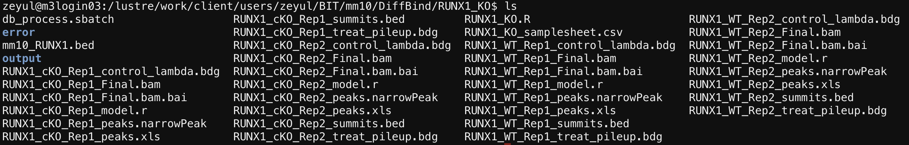
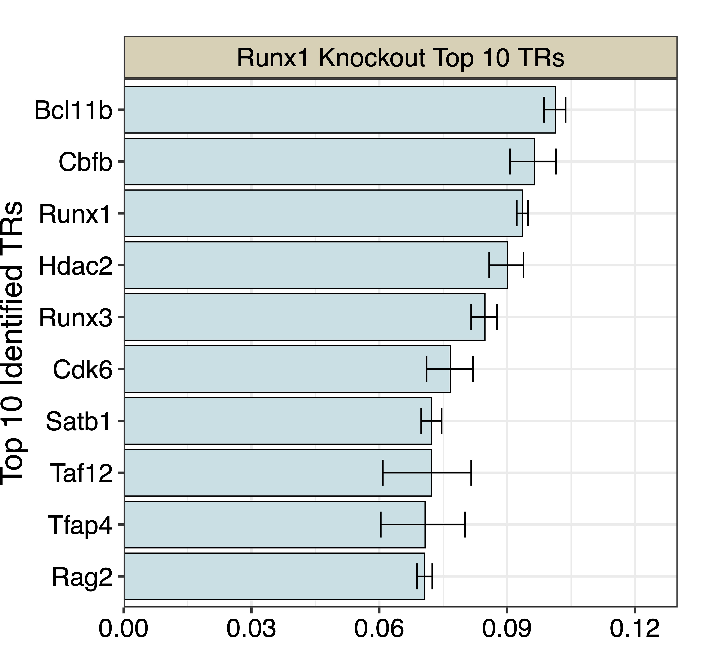
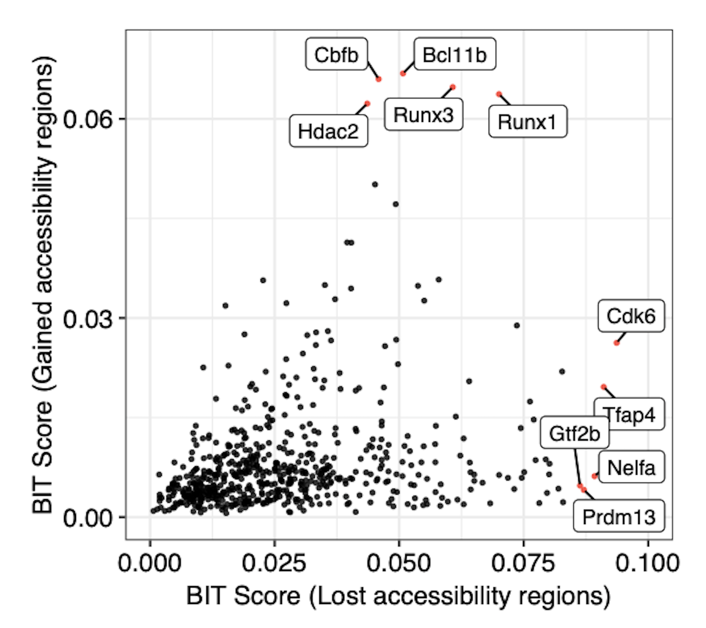

RUNX1 Plots
====================

The following example demonstrates how to process raw ATAC-seq data obtained from the Sequence Read Archive (SRA). Specifically, the workflow includes data download, quality checking, trimming, alignment with Bowtie2, format conversion with Samtools, duplicate removal, and peak calling using MACS2. This complete pipeline ensures high-quality data preparation for generating BIT plots.

For illustration purposes, the pipeline below demonstrates processing for a single sample (RUNX1_WT_DN3_Rep1). However, in a complete analysis, three additional samples are required, including two replicates from knockout conditions and one additional replicate from the wild-type control.

.. code-block:: bash

   #!/bin/bash
   #SBATCH -J Fully_Process_Scripts_ATAC_seq
   #SBATCH -o ./output/output-%j.out
   #SBATCH -e ./error/error-%j.out
   #SBATCH -p standard-s --mem=64G

   # Change the directory as necessary
   LOG_DIR="/lustre/work/client/users/zeyul/BIT/mm10/data/log/"
   MM10_REF_DIR="/lustre/work/client/users/BIT/tools/mm10_ref_bowtie2/mm10"
   DATA_DIR="/lustre/work/client/users/zeyul/BIT/mm10/data/"
   FastQC_DIR="/lustre/work/client/users/zeyul/BIT/mm10/FastQC/"
   PEAK_DIR="/lustre/work/client/users/zeyul/BIT/mm10/results/"
   DiffBind_DIR="/lustre/work/client/users/zeyul/BIT/mm10/DiffBind/"

   MIDDLE_DIR="RUNX1_KO/"

   # Specific the final ATAC-seq filename and SRX number
   ATAC_NAME_1="RUNX1_WT_Rep1"
   SRX_NUMBER="SRR24493103"
   #SRX_NUMBER="SRR24493101" WT Rep2
   #SRX_NUMBER="SRR24493100" cKO Rep1
   #SRX_NUMBER="SRR24493099" cKO Rep2

   mkdir -p "${DATA_DIR}${MIDDLE_DIR}"
   mkdir -p "${LOG_DIR}${MIDDLE_DIR}"
   mkdir -p "${FastQC_DIR}${MIDDLE_DIR}"
   mkdir -p "${PEAK_DIR}${MIDDLE_DIR}"

   ## Download Data
   fasterq-dump --progress "$SRX_NUMBER" -o "${DATA_DIR}${MIDDLE_DIR}${ATAC_NAME_1}.fastq"

   ## FastQC before Trimming
   fastqc --noextract --nogroup -o "${FastQC_DIR}${MIDDLE_DIR}" "${DATA_DIR}${MIDDLE_DIR}${ATAC_NAME_1}_1.fastq" "${DATA_DIR}${MIDDLE_DIR}${ATAC_NAME_1}_2.fastq"

   ## Trimming with trim-galore
   trim_galore --paired -q 20 --phred33 --length 25 -e 0.1 --stringency 4 -o "${DATA_DIR}${MIDDLE_DIR}" "${DATA_DIR}${MIDDLE_DIR}${ATAC_NAME_1}_1.fastq" "${DATA_DIR}${MIDDLE_DIR}${ATAC_NAME_1}_2.fastq"
   mkdir -p "${PEAK_DIR}${MIDDLE_DIR}"

   ## FastQC post-trimming
   fastqc --noextract --nogroup -o "${FastQC_DIR}${MIDDLE_DIR}" "${DATA_DIR}${MIDDLE_DIR}${ATAC_NAME_1}_1_val_1.fq" "${DATA_DIR}${MIDDLE_DIR}${ATAC_NAME_1}_2_val_2.fq"

   ## bowtie2 Alignment
   bowtie2 --very-sensitive -X 2000 -p 8 -q --local \
   -x "${MM10_REF_DIR}" \
   -1 "${DATA_DIR}${MIDDLE_DIR}${ATAC_NAME_1}_1_val_1.fq" -2 "${DATA_DIR}${MIDDLE_DIR}${ATAC_NAME_1}_2_val_2.fq" \
   -S "${DATA_DIR}${MIDDLE_DIR}${ATAC_NAME_1}.sam"

   ## Samtools transfer to BAM
   samtools view -h -S -b \
   -o "${DATA_DIR}${MIDDLE_DIR}${ATAC_NAME_1}.bam" \
   "${DATA_DIR}${MIDDLE_DIR}${ATAC_NAME_1}.sam"
   samtools sort -n -o "${DATA_DIR}${MIDDLE_DIR}${ATAC_NAME_1}_sorted.bam" -O BAM "${DATA_DIR}${MIDDLE_DIR}${ATAC_NAME_1}.bam"
   samtools fixmate -m "${DATA_DIR}${MIDDLE_DIR}${ATAC_NAME_1}_sorted.bam" "${DATA_DIR}${MIDDLE_DIR}${ATAC_NAME_1}_fixmate.bam"
   rm "${DATA_DIR}${MIDDLE_DIR}${ATAC_NAME_1}_sorted.bam"
   samtools sort -o "${DATA_DIR}${MIDDLE_DIR}${ATAC_NAME_1}_sorted.bam" "${DATA_DIR}${MIDDLE_DIR}${ATAC_NAME_1}_fixmate.bam"
   samtools markdup -r -s "${DATA_DIR}${MIDDLE_DIR}${ATAC_NAME_1}_sorted.bam" "${DATA_DIR}${MIDDLE_DIR}${ATAC_NAME_1}_Final.bam"
   samtools index "${DATA_DIR}${MIDDLE_DIR}${ATAC_NAME_1}_Final.bam"

   samtools index "${DATA_DIR}${MIDDLE_DIR}${ATAC_NAME_1}_Final.bam"

   ## Peak Calling
   macs2 callpeak -f BAM -g mm -n "${PEAK_DIR}${MIDDLE_DIR}${ATAC_NAME_1}" -B -q 0.01 -t "${DATA_DIR}${MIDDLE_DIR}${ATAC_NAME_1}_Final.bam"

   # For DiffBind
   mv "${DATA_DIR}${MIDDLE_DIR}${ATAC_NAME_1}_Final.bam" "${DATA_DIR}${MIDDLE_DIR}${ATAC_NAME_1}_peaks.narrowPeak" "${PEAK_DIR}${MIDDLE_DIR}"

The processed files need to be put in the same folder for the downstream ``DiffBind`` analysis

For DiffBind, we need to first formulate a samplesheet to list the datasets:

.. csv-table:: DiffBind Samplesheet
   :file: ../tables/Examples/RUNX1_KO/RUNX1_KO_samplesheet.csv
   :header-rows: 1

Next we need to use DiffBind to process and generate the differentially accessible region set.

.. code-block:: r

   library(DiffBind)
   library(rtracklayer)

   print(getwd())
   samplesheet <- read.csv("RUNX1_KO_samplesheet.csv")
   RUNX1_KO <- dba(sampleSheet = samplesheet)
   RUNX1_KO <- dba.count(RUNX1_KO, minOverlap = 2)
   RUNX1_KO <- dba.blacklist(RUNX1_KO, blacklist = DBA_BLACKLIST_MM10)
   RUNX1_KO$config$cores = 64
   RUNX1_KO$config$bUsePval = TRUE
   RUNX1_KO$th = 0.20
   RUNX1_KO_norm <- dba.normalize(RUNX1_KO, method = DBA_DESEQ2,
                                  normalize = DBA_NORM_NATIVE,
                                  library = DBA_LIBSIZE_BACKGROUND,
                                  background = TRUE)
   RUNX1_KO_ct <- dba.contrast(RUNX1_KO_norm, categories = DBA_CONDITION, minMembers = 2)
   RUNX1_KO_results <- dba.analyze(RUNX1_KO_ct, method = DBA_DESEQ2)
   RUNX1_KO <- dba.report(RUNX1_KO_results, file = "RUNX1_cKO_report.csv", th = 0.1)
   export.bed(RUNX1_KO, "mm10_RUNX1.bed")

The exported BED file can be shown as:

.. code-block:: r

   # Load required library
   library(rtracklayer)

   # Define file path
   RUNX1_BED <- "/Users/zeyulu/Desktop/Project/BIT/Input_Data/DARs/mm10_RUNX1.bed"

   # Import BED file
   import(RUNX1_BED)

.. code-block:: console

   Loading required package: GenomicRanges
   Loading required package: GenomeInfoDb
   Warning message:
   package ‘GenomeInfoDb’ was built under R version 4.4.2

   GRanges object with 15652 ranges and 2 metadata columns:
             seqnames              ranges strand |        name     score
                <Rle>           <IRanges>  <Rle> | <character> <numeric>
         [1]     chr3 143678121-143678521      * |       40711         0
         [2]    chr12   21480229-21480629      * |       12636         0
         [3]     chr1 192778787-192779187      * |        4468         0
         [4]    chr13     9547929-9548329      * |       15220         0
         [5]     chr7   88206431-88206831      * |       55040         0
         ...      ...                 ...    ... .         ...       ...
     [15648]     chr1   52799363-52799763      * |         796         0
     [15649]    chr14 105700293-105700693      * |       20509         0
     [15650]    chr12 111072186-111072586      * |       14669         0
     [15651]    chr16   93031654-93032366      * |       25272         0
     [15652]     chr4 117190116-117190516      * |       43363         0
     -------
     seqinfo: 24 sequences from an unspecified genome; no seqlengths

We next apply BIT to the exported BED file and generate the TR ranked table:

.. code-block:: r
    library(BIT)
    RUNX1_BED="mm10_RUNX1.bed"
    output_path="./test"
    BIT(RUNX1_BED,output,output_path,genome="mm10")

    RUNX1_Tab<-read.csv("./test/mm10_RUNX1_rank_table.csv",row.names=1)
    head(RUNX1_Tab,10)

.. code-block:: console

        TR   Theta_i     lower     upper  BIT_score BIT_score_lower BIT_score_upper Rank
    1  Bcl11b -2.182627 -2.212789 -2.156569 0.10132149      0.09860792      0.10371893    1
    2    Cbfb -2.238118 -2.305173 -2.180754 0.09637935      0.09069547      0.10149211    2
    3   Runx1 -2.269733 -2.286438 -2.255767 0.09366088      0.09225243      0.09485314    3
    4   Hdac2 -2.312496 -2.366128 -2.267778 0.09009334      0.08579231      0.09382692    4
    5   Runx3 -2.378822 -2.421391 -2.343063 0.08480192      0.08155599      0.08761877    5
    6    Cdk6 -2.488816 -2.570101 -2.415317 0.07664596      0.07108760      0.08201211    6
    7   Satb1 -2.551729 -2.589306 -2.517789 0.07231043      0.06982987      0.07462051    7
    8   Taf12 -2.552330 -2.737449 -2.421156 0.07227008      0.06079942      0.08157363    8
    9   Tfap4 -2.575503 -2.745504 -2.441114 0.07073173      0.06034110      0.08009081    9
   10   Rag2 -2.576603 -2.604533 -2.550052 0.07065946      0.06884723      0.07242299   10

And we can plot the top 10 TRs:

.. code-block:: r

   # Load required libraries
   library(ggplot2)

   # Read the CSV file
   RUNX1_Tab <- read.csv("/Users/zeyulu/Desktop/Project/BIT/revision_data/bin_width/1000/mm10_RUNX1_rank_table.csv", row.names = 1)

   # Prepare data frame for visualization
   data <- data.frame(
       Group = "Runx1 Knockout Top 10 TRs",
       Label = RUNX1_Tab[1:10, "TR"],
       Value = RUNX1_Tab[1:10, "BIT_score"],
       Upper = RUNX1_Tab[1:10, "BIT_score_upper"],
       Lower = RUNX1_Tab[1:10, "BIT_score_lower"]
   )

   # Convert Label to factor for ordering in the plot
   data$Label <- factor(data$Label, levels = rev(data$Label))

   # Create the plot using ggplot2
   p1 <- ggplot(data, aes(x = Label, y = Value)) +
       geom_col(fill = "#C1E0E4", colour = "black", size = 0.25) +
       geom_errorbar(aes(ymin = Lower, ymax = Upper), width = 0.5, color = "black", size = 0.35) +
       coord_flip() +  # Flip coordinates for a horizontal bar plot
       facet_grid(. ~ Group, scales = "free_y") +  # Facet by group
       labs(title = "", x = "Top 10 Identified TRs", y = "") +
       scale_y_continuous(limits = c(0, 0.13), breaks = seq(0, 0.12, by = 0.03), expand = c(0, 0)) +
       theme_bw() +  # Minimal theme
       theme(
           axis.text.x = element_text(color = "black", size = 12),
           axis.text.y = element_text(color = "black", size = 12),
           axis.title.y = element_text(size = 14),
           legend.position = "none",
           plot.margin = unit(c(0, 0.5, 0, 0), "cm"),
           strip.background = element_rect(fill = "#DBD1B6"),
           strip.text = element_text(size = 12, colour = "black")
       )

   # Display the plot
   print(p1)

We can also generate the plot by comparing the BIT-identified TRs from using increased accessibility regions versus decreased accessibility regions. We separate the regions in the DiffBind generated report based on fold enrichment:

.. code-block:: r

   # Define file path
   RUNX1_report <- "./test/RUNX1_cKO_report.csv"

   # Read the CSV file
   RUNX1_report_tab <- read.csv(RUNX1_report)

   # Display the first six rows
   head(RUNX1_report_tab)

.. code-block:: console

               Chr     Start       End     Conc  Conc_KO  Conc_WT      Fold      p.value          FDR
    1         chr3 143678121 143678521 7.277114 5.857603 7.978584 -1.986227 8.208806e-23 5.317866e-18
    2        chr12  21480229  21480629 6.594209 4.497721 7.414836 -2.670207 1.638762e-22 5.317866e-18
    3         chr1 192778787 192779187 7.073688 5.673339 7.770717 -1.954896 1.053971e-20 2.280126e-16
    4        chr13   9547929   9548329 7.420042 6.200425 8.071361 -1.751839 1.479800e-20 2.401012e-16
    5         chr7  88206431  88206831 7.940753 7.026219 8.496063 -1.409733 9.299981e-20 1.207156e-15
    6 chrUn_JH584304     55478     55878 8.066727 7.232130 8.592054 -1.310974 1.948392e-19 2.107543e-15

We separate the table based on the fold enrichment change (Column: Fold)

.. code-block:: r

   # Load required library
   library(dplyr)

   # Separate rows based on the 'Fold' column
   positive_fold <- RUNX1_report_tab %>%
     dplyr::filter(Fold > 0) %>%
     dplyr::select(Chr, Start, End)

   negative_fold <- RUNX1_report_tab %>%
     dplyr::filter(Fold < 0) %>%
     dplyr::select(Chr, Start, End)

   # Define output file paths
   positive_bed_file <- "./test/RUNX1_KO_increased.bed"
   negative_bed_file <- "./test/RUNX1_KO_decreased.bed"

   # Export to .bed files without headers and row names
   write.table(positive_fold, file = positive_bed_file, sep = "\t",
               row.names = FALSE, col.names = FALSE, quote = FALSE)

   write.table(negative_fold, file = negative_bed_file, sep = "\t",
               row.names = FALSE, col.names = FALSE, quote = FALSE)

   # Print messages for confirmation
   cat("Positive fold BED file saved to:", positive_bed_file, "\n")
   cat("Negative fold BED file saved to:", negative_bed_file, "\n")

.. code-block:: r

   # Load required library
   library(rtracklayer)

   # Import BED files
   RUNX1_KO_increased <- import("./test/RUNX1_KO_increased.bed")
   RUNX1_KO_decreased <- import("./test/RUNX1_KO_decreased.bed")

   # Display summary of imported GRanges objects
   RUNX1_KO_increased
   RUNX1_KO_decreased

Console Output
--------------

After executing the script, the following output is displayed:

**Increased RUNX1 Binding Regions:**

.. code-block:: console

   GRanges object with 4054 ranges and 0 metadata columns:
               seqnames              ranges strand
                  <Rle>           <IRanges>  <Rle>
     [1] chrUn_JH584304         26924-27323      *
     [2]           chr2 105358113-105358512      *
     [3]           chr7   12987445-12987844      *
     [4]           chr3 126628458-126628857      *
     [5]           chr3 144260784-144261183      *
     ...            ...                 ...    ...
  [4050]          chr15   83563327-83563726      *
  [4051]           chr5 100070187-100070586      *
  [4052]           chr5 122274739-122275138      *
  [4053]          chr16   93031655-93032366      *
  [4054]           chr4 117190117-117190516      *
  -------
  seqinfo: 21 sequences from an unspecified genome; no seqlengths

**Decreased RUNX1 Binding Regions:**

.. code-block:: console

   GRanges object with 11598 ranges and 0 metadata columns:
          seqnames              ranges strand
             <Rle>           <IRanges>  <Rle>
      [1]     chr3 143678122-143678521      *
      [2]    chr12   21480230-21480629      *
      [3]     chr1 192778788-192779187      *
      [4]    chr13     9547930-9548329      *
      [5]     chr7   88206432-88206831      *
      ...      ...                 ...    ...
  [11594]     chr3   69177462-69177861      *
  [11595]    chr19   49358664-49359063      *
  [11596]     chr1   52799364-52799763      *
  [11597]    chr14 105700294-105700693      *
  [11598]    chr12 111072187-111072586      *
  -------
  seqinfo: 24 sequences from an unspecified genome; no seqlengths

.. code-block:: r

    BIT("./test/RUNX1_KO_increased.bed",output_path = "./test",genome="mm10")
    BIT("./test/RUNX1_KO_decreased.bed",output_path = "./test",genome="mm10")

    RUNX1_KO_increased_table<-read.csv("./test/RUNX1_KO_increased_ranked_table.csv",row.names=1)
    RUNX1_KO_decreased_table<-read.csv("./test/RUNX1_KO_decreased_ranked_table.csv",row.names=1)

    head(RUNX1_KO_increased_table,10)
    head(RUNX1_KO_decreased_table,10)

**Top 10 Transcription Factors with Increased RUNX1 Binding:**

.. code-block:: console

       TR   Theta_i     lower     upper  BIT_score BIT_score_lower BIT_score_upper Rank
    1    Cdk6 -2.269732 -2.346700 -2.191284 0.09366096      0.08732846      0.10053591    1
    2   Tfap4 -2.300801 -2.476280 -2.151916 0.09105663      0.07753786      0.10415227    2
    3   Nelfa -2.323227 -2.383067 -2.269906 0.08921751      0.08447306      0.09364617    3
    4  Prdm13 -2.349848 -2.779716 -2.113548 0.08707787      0.05843018      0.10778697    4
    5   Gtf2b -2.359566 -2.438576 -2.282325 0.08630845      0.08027799      0.09259738    5
    6    Hopx -2.403542 -2.842773 -2.158268 0.08290301      0.05505610      0.10356115    6
    7   Taf12 -2.406057 -2.580908 -2.261903 0.08271200      0.07037728      0.09432769    7
    8   Hcfc1 -2.415879 -2.497010 -2.340737 0.08196985      0.07606804      0.08780486    8
    9     Sp1 -2.439917 -2.478637 -2.403042 0.08017906      0.07736944      0.08294104    9
   10  Smyd3 -2.440939 -2.883030 -2.210205 0.08010367      0.05299888      0.09883785   10

**Top 10 Transcription Factors with Decreased RUNX1 Binding:**

.. code-block:: console

       TR   Theta_i     lower     upper  BIT_score BIT_score_lower BIT_score_upper Rank
    1   Runx1 -2.636133 -2.652424 -2.620706 0.06684889      0.06583978      0.06781762    1
    2   Runx3 -2.649796 -2.687546 -2.615387 0.06600161      0.06371226      0.06815469    2
    3  Bcl11b -2.669601 -2.707113 -2.636979 0.06479117      0.06255495      0.06679608    3
    4    Cbfb -2.687242 -2.759915 -2.626894 0.06373039      0.05952911      0.06742752    4
    5   Hdac2 -2.711423 -2.768347 -2.660408 0.06230267      0.05905879      0.06535040    5
    6   Satb1 -2.941911 -2.979089 -2.906946 0.05012021      0.04837957      0.05181126    6
    7    Mta2 -3.006050 -3.069515 -2.949720 0.04715331      0.04438241      0.04974976    7
    8   Ikzf1 -3.142564 -3.176731 -3.112130 0.04138527      0.04005082      0.04260968    8
    9    Chd4 -3.143628 -3.212739 -3.077606 0.04134311      0.03868915      0.04404050    9
   10   Tcf7 -3.293910 -3.413210 -3.195326 0.03578072      0.03188515      0.03934199   10

.. code-block:: r
  RUNX1_KO_increase<-read.csv("./test/RUNX1_KO_increase_rank_table.csv")
  RUNX1_KO_decrease<-read.csv("./test/RUNX1_KO_decrease_rank_table.csv")

  data1<-data.frame(x1=RUNX1_KO_increase$BIT_score,y1=RUNX1_KO_decrease$BIT_score[match(RUNX1_KO_increase$TR,RUNX1_KO_decrease$TR)],label1="")
  labels<-c(RUNX1_KO_increase$TR[1:5],RUNX1_KO_decrease$TR[1:5])
  data1$label1[!is.na(match(RUNX1_KO_increase$TR,labels))]=labels

  plot1 <- ggplot(data1, aes(x = x1, y = y1, color = (label1 != ""))) +
    geom_point(alpha = 0.8, shape = 20, stroke = 0.2) +
    geom_label_repel(
      aes(label = label1), max.overlaps = 20,
      min.segment.length = unit(0, 'lines'),
      color = "black", size = 3, fill = "white"
    ) +
    # Manually set colors: labeled = red, not labeled = black
    scale_color_manual(values = c("TRUE" = "red", "FALSE" = "black")) +
    theme_bw() +
    theme(
      axis.text.x = element_text(color="black", size=11),
      axis.text.y = element_text(color="black", size=11),
      legend.position = "none"         # hide legend
    ) +
    labs(x = "", y = "BIT Score (Lost accessibility regions)") +
    scale_y_continuous(limits = c(0, 0.07),
                     breaks = c(0, 0.03, 0.06, 0.09, 0.12)) + xlim(0,0.1)
  plot1

