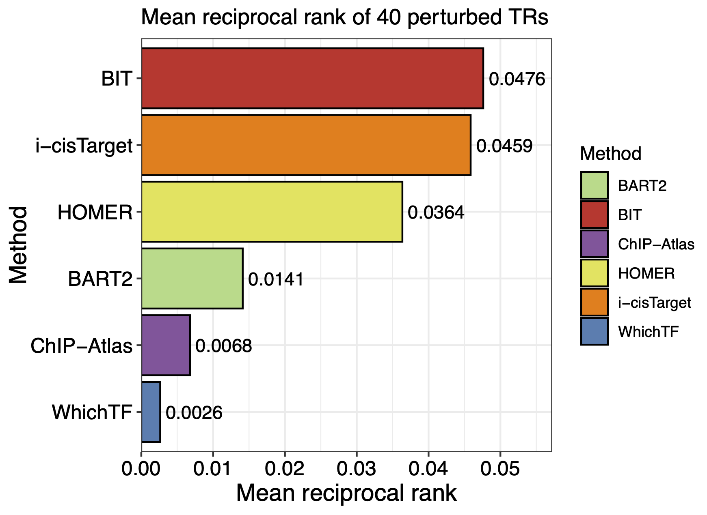

K562 Perturbation
====================

For preprocessing the CRISPR screen with scATAC-seq data, we use the pipeline provided by the data author: `Pipeline <https://github.com/GreenleafLab/SpearATAC_MS_2021/tree/main>`_

- Pierce, S. E., Granja, J. M. & Greenleaf, W. J. High-throughput single-cell chromatin accessibility CRISPR screens enable unbiased identification of regulatory networks in cancer. Nat Commun 12, 2969 (2021). `10.1038/s41467-021-23213-w <https://www.nature.com/articles/s41467-021-23213-w>`_

To initiate the preprocessing, we first retrieve the sequencing data as listed in the following table:

.. csv-table:: K562 files
   :file: ../tables/Examples/K562/K562_Files.csv
   :header-rows: 1

Once the required files are obtained, we can modify the pipeline to process the data, certain steps require extra functions defined in a separate R file provided by the data author:

.. code-block:: r

  ###########################################
  # Analysis of Spear-ATAC-Screens
  ###########################################
  library(ArchR)
  library(Matrix)
  library(Biostrings)
  library(edgeR)

  addArchRGenome("hg38")
  addArchRThreads(20)

  #Make Sure Data is present
  source("Scripts/Download-Test-SpearATAC-Data.R")

  #Helpful functions designed for SpearATAC Analysis
  source("../scPerturb/Scripts/SpearATAC-Functions.R")

  #Input Fragments
  #Note we had 6 replicates for K562 but we will show 2 here for simplicity
  inputFiles <- c(
    "K562_R1"="./K562/K562-LargeScreen-R1.fragments.tsv.gz",
    "K562_R2"="./K562/K562-LargeScreen-R2.fragments.tsv.gz",
    "K562_R3"="./K562/K562-LargeScreen-R3.fragments.tsv.gz",
    "K562_R4"="./K562/K562-LargeScreen-R4.fragments.tsv.gz",
    "K562_R4"="./K562/K562-LargeScreen-R5.fragments.tsv.gz",
    "K562_R4"="./K562/K562-LargeScreen-R6.fragments.tsv.gz"
  )

  #Get Valid Barcodes
  validBC <- getValidBarcodes(
    csvFiles = c("./K562/K562-LargeScreen-R1.singlecell.csv", "./K562/K562-LargeScreen-R2.singlecell.csv",
                 "./K562/K562-LargeScreen-R3.singlecell.csv", "./K562/K562-LargeScreen-R4.singlecell.csv",
                 "./K562/K562-LargeScreen-R5.singlecell.csv", "./K562/K562-LargeScreen-R6.singlecell.csv"),
    sampleNames = c("K562_R1", "K562_R2", "K562_R3", "K562_R4","K562_R5", "K562_R6")
  )

  #Get sgRNA Assignments Files that names match the sample names in the ArchRProject
  #Files were created from JJJ.R
  sgRNAFiles <- c("K562_R1"="./K562/K562-LargeScreen-R1.sgRNA.rds", "K562_R2"="./K562/K562-LargeScreen-R2.sgRNA.rds",
                  "K562_R3"="./K562/K562-LargeScreen-R3.sgRNA.rds", "K562_R4"="./K562/K562-LargeScreen-R4.sgRNA.rds",
                  "K562_R5"="./K562/K562-LargeScreen-R5.sgRNA.rds", "K562_R6"="./K562/K562-LargeScreen-R6.sgRNA.rds")

  #Create Arrow Files
  ArrowFiles <- createArrowFiles(inputFiles=inputFiles, validBarcodes = validBC)
  ArrowFiles

  #Make an ArchR Project
  proj <- ArchRProject(ArrowFiles, outputDirectory = "K562_LS")

  #Create an sgRNA assignment matrix
  #Iterate over each sgRNA aligned file
  createSpMat <- function(i,j){
    ui <- unique(i)
    uj <- unique(j)
    m <- Matrix::sparseMatrix(
      i = match(i, ui),
      j = match(j, uj),
      x = rep(1, length(i)),
      dims = c(length(ui), length(uj))
    )
    rownames(m) <- ui
    colnames(m) <- uj
    m
  }

  sgAssign <- lapply(seq_along(sgRNAFiles), function(x){

    message(x)

    #Read in sgRNA Data Frame
    sgDF <- readRDS(sgRNAFiles[x])

    #Create sparseMatrix of sgRNA assignments
    sgMat <- createSpMat(sgDF[,1], sgDF[,2])

    #Create Column Names that match EXACTLY with those in the ArchR Project
    #Cell barcodes in our case were the reverse complement to thos in the scATAC-seq data
    colnames(sgMat) <- paste0(names(sgRNAFiles)[x],"#", reverseComplement(DNAStringSet(colnames(sgMat))),"-1")

    #Check This
    if(sum(colnames(sgMat) %in% proj$cellNames) < 2){
      stop("x=",x,"; Error matching of sgRNA cell barcodes and scATAC-seq cell barcodes was unsuccessful. Please check your input!")
    }

    #Filter those that are in the ArchR Project
    sgMat <- sgMat[,colnames(sgMat) %in% proj$cellNames,drop=FALSE]

    #Compute sgRNA Staistics
    df <- DataFrame(
      cell = colnames(sgMat), #Cell ID
      sgAssign = rownames(sgMat)[apply(sgMat, 2, which.max)], #Maximum sgRNA counts Assignment
      sgCounts =  apply(sgMat, 2, max), #Number of sgRNA counts for max Assignment
      sgTotal = Matrix::colSums(sgMat), #Number of total sgRNA counts across all Assignments
      sgSpec = apply(sgMat, 2, max) / Matrix::colSums(sgMat) #Specificity of sgRNA assignment
    )

    #Return this dataframe
    df

  }) %>% Reduce("rbind", .)

  sgAssign

  #Make the rownames the cell barcodes
  rownames(sgAssign) <- sgAssign[,1]

  #Plot Cutoffs of sgRNA Assignment (NOTE: You may want to adjust these cutoffs based on your results!)
  nSg <- 20
  Spec <- 0.8
  p <- ggPoint(log10(sgAssign$sgCounts), sgAssign$sgSpec, colorDensity = TRUE) +
    geom_vline(xintercept = log10(nSg), lty = "dashed") +
    geom_hline(yintercept = Spec, lty = "dashed") +
    xlab("log10(sgCounts)") + ylab("Specificity")
  plotPDF(p, name = "Plot-Assignment-Density", addDOC = FALSE, width = 5, height = 5)

  #Add all this information to your ArchRProject
  proj <- addCellColData(proj, data = sgAssign$sgAssign, name = "sgAssign", cells = rownames(sgAssign), force = TRUE)
  proj <- addCellColData(proj, data = sgAssign$sgCounts, name = "sgCounts", cells = rownames(sgAssign), force = TRUE)
  proj <- addCellColData(proj, data = sgAssign$sgTotal, name = "sgTotal", cells = rownames(sgAssign), force = TRUE)
  proj <- addCellColData(proj, data = sgAssign$sgSpec, name = "sgSpec", cells = rownames(sgAssign), force = TRUE)

  #Identify those sgRNA Assignemnets that passed your cutoffs
  proj$sgAssign2 <- NA
  proj$sgAssign2[which(proj$sgCounts > nSg & proj$sgSpec > Spec)] <- proj$sgAssign[which(proj$sgCounts > nSg & proj$sgSpec > Spec)]
  proj$sgAssign3 <- stringr::str_split(proj$sgAssign2,pattern="\\-",simplify=TRUE)[,1]

  #Print Numbers
  table(proj$sgAssignFinal)
  #sgARID2  sgARID3A    sgATF1    sgATF3  sgBCLAF1    sgBRF2     sgCAD   sgCDC5L   sgCEBPB   sgCEBPZ    sgCTCF    sgCUX1    sgELF1
  #    336       201       397       182       351       359       186       247       341       399       258       352       399
  #sgFOSL1   sgGABPA   sgGATA1   sgGTF2B   sgHINFP   sgHSPA5    sgKLF1   sgKLF16     sgMAX     sgMYC    sgNFE2    sgNFYB    sgNRF1
  #    402       282       223       197       339       262       219       231       269       196       341       356       305
  #sgPBX2  sgPOLR1D    sgREST    sgRPL9  sgSETDB1    sgsgNT     sgTBP   sgTFDP1   sgTHAP1  sgTRIM28     sgYY1  sgZBTB11 sgZNF280A
  #   366       311       349       247       393      1616       349       350       244       360       288       363       393
  #sgZNF407    sgZZZ3       UNK
  #     373       338     18861

  #########################################################################
  #We suggest saving your progress at this moment
  #########################################################################
  saveRDS(proj, "Save-ArchRProject-W-sgRNA-Assignments-1.rds")

  sgRNA<-getCellColData(proj,"sgAssign3")
  groupList <- SimpleList(split(rownames(sgRNA), paste0(sgRNA[,1])))

  sgRNA$sgAssign3

  uniqSg <- unique(sgRNA[,1])
  uniqSg <- uniqSg[!is.na(uniqSg)]
  uniqSg <- uniqSg[uniqSg %ni% nonTarget]

  uniqSg

  groupList
  #We now want to clean our sgAssignments based on the homogeneity of the sgRNA signal. This analysis shouldnt filter more than 5-10%
  #of sgRNA assignments. This will help resolve your differential analyses but is not crucial for downstream analysis.
  proj <- cleanSgRNA(ArchRProj = proj, groupSg = "sgAssign3", individualSg = "sgAssign2", nonTarget = "sgsgNT")
  proj$sgAssignFinal <- "UNK"
  proj$sgAssignFinal[proj$PurityRatio >= 0.9] <- proj$sgAssign3[proj$PurityRatio >= 0.9]
  proj$sgIndividual <- ifelse(proj$sgAssignFinal=="UNK", "UNK", proj$sgAssign2)

  #Lets create an unbiased LSI-UMAP to sgRNA assignments by creating an iterativeLSI reduction + UMAP
  proj <- addIterativeLSI(proj)
  proj <- addUMAP(proj,force=TRUE)

  #Create Color Palettes
  pal4 <- paletteDiscrete(paste0(unique(proj$Sample)))

  pal1 <- paletteDiscrete(paste0(unique(proj$sgAssign2)))
  pal1["NA"] <- "lightgrey"

  pal2 <- paletteDiscrete(paste0(unique(proj$sgAssign3)))
  pal2["NA"] <- "lightgrey"

  pal3 <- paletteDiscrete(paste0(unique(proj$sgAssignFinal)))
  pal3["UNK"] <- "lightgrey"

  pal3

  #Plot UMAP Embeddings
  p1 <- plotEmbedding(proj, colorBy = "cellColData", name = "Sample", pal=pal4,labelMeans = FALSE)
  p2 <- plotEmbedding(proj, colorBy = "cellColData", name = "sgAssignFinal", pal = pal3, labelMeans = FALSE)

  ggsave(
    "./Plots/K562_UMAP_p1.pdf", p1,
    scale = 1,
    width = 8,
    height = 8,
    dpi = 600)

  ggsave(
    "./Plots/K562_UMAP_p2.pdf", p2,
    scale = 1,
    width = 8,
    height = 8,
    dpi = 600)

  #Call Peaks using sgAssignments
  proj <- addGroupCoverages(proj, groupBy = "sgAssignFinal")
  saveRDS(proj, "Save-ArchRProject-W-sgRNA-Assignments-2.rds")
  proj <- addReproduciblePeakSet(proj,
                                 groupBy = "sgAssignFinal",
                                 pathToMacs2 = "/Users/zeyulu/anaconda3/bin/macs2")

  proj <- addPeakMatrix(proj)

  #Filter These sgRNA non-targetting because they seem to exhibit some differences from the other sgNT
  #This step helps a bit, but is not necessary to get differential results
  bgd <- grep("sgNT", proj$sgIndividual, value=TRUE) %>% unique

  bgd
  bgd <- bgd[!grepl("-11|-12|-8|-5|-6", bgd)]
  proj$sgAssignClean <- proj$sgAssignFinal
  proj$sgAssignClean[grepl("-11|-12|-8|-5|-6", proj$sgIndividual)] <- "UNK"

  #Sort sgRNA Targets so Results are in alphabetical order
  useGroups <- sort(unique(proj$sgAssignClean)[unique(proj$sgAssignClean) %ni% c("UNK")])
  bgdGroups <- unique(grep("sgNT", proj$sgAssignClean,value=TRUE))

  useGroups
  bgdGroups
  proj
  #Differential Peaks
  diffPeaks <- getMarkerFeatures(
    ArchRProj = proj,
    testMethod = "binomial",
    binarize = TRUE,
    useMatrix = "PeakMatrix",
    useGroups = useGroups,
    bgdGroups = bgdGroups,
    groupBy = "sgAssignClean",
    bufferRatio = 0.95,
    maxCells = 250,
    threads = 10
  )
  dir.create("./K562/MarkerSet/", showWarnings = FALSE, recursive = TRUE)
  markerLists<-getMarkers(DiffPeaks,cutOff = "FDR <= 0.05 & abs(Log2FC) >= 2")
  unique_TF_names<-names(markerLists)
  unique_TF_names
  for(i in 1:length(markerLists)){
    if(nrow(markerLists[[i]])>0){
      gr<-GRanges(
        seqnames = as.character(markerLists[[unique_TF_names[i]]]$seqnames),
        ranges = IRanges(start = markerLists[[unique_TF_names[i]]]$start, end = markerLists[[unique_TF_names[i]]]$end),
        strand = "*",
        score = abs(markerLists[[unique_TF_names[i]]]$Log2FC))
      export.bed(gr,paste0("./K562/MarkerSet/",unique_TF_names[i],".bed"))
    }
  }

We can generate the UMAP plots colored by sample replicates or sgRNA target.

By sample replicate:

By sgRNA target:

After processing, we obtain ``*.bed`` files for each sgRNA target.

Next we apply BIT to all datasets to generate the ranks:

.. code-block:: r
  work_dir<-"./K562/MarkerSet/"
  work_files<-list.files(work_dir)
  output_dir<-"./K562/bit"

  dir.create(output_dir, showWarnings = FALSE, recursive = TRUE)

  for(i in seq_along(work_files)){
    BIT(paste0(work_dir,work_files[i]),output_dir,plot_bar=FALSE,genome="hg38")
  }

Noticed in plot 1 and in the original publication, the sgGATA1 targeted cells are more significantly differ from the rest cells. We show the top10 TRs ranked by BIT in the sgGATA1 targeted cells:

.. code-block:: r

  data_read<-read.csv(paste0("./K562/bit/sgGATA1_rank_table.csv"))
  data<-data.frame(Group="sgGATA1 targeted cells",
                   Label=data_read[1:20,"TR"],
                   Value=data_read[1:20,"BIT_score"],
                   Upper=data_read[1:20,"BIT_score_upper"],
                   Lower=data_read[1:20,"BIT_score_lower"])
  data$Label<-factor(data$Label,levels=rev(data$Label))
  top10_data <- data[1:10, ]

  p1<-ggplot(top10_data, aes(x = Label, y = Value)) +
    geom_col(fill="#BADDF5",colour="black",size=0.25) +
    geom_errorbar(aes(ymin = Lower, ymax = Upper), width = 0.5, color = "black", size = 0.35) +
    coord_flip() +  # Flip coordinates to make the bar plot horizontal
    facet_grid(.~Group, scales = "free_y") +  # Facet by group, allowing free scales on the y-axis
    labs(title = "",
         x = "Top 10 Identified TRs",
         y = "") + scale_y_continuous(limits=c(0,0.05),breaks=seq(0,0.5,by=0.01),expand = c(0,0)) +
    theme_bw() +  # Using a minimal theme
    theme(axis.text.x = element_text(color="black",size=12),
          axis.text.y = element_text(color="black",size=12),axis.title.y=element_text(size=14),
          legend.position = "none", plot.margin = unit(c(0,0.5,0,0),"cm")) +theme(strip.background = element_rect(fill="#DBD1B6"),
                                                                                  strip.text = element_text(size=12, colour="black"))
  p1

We can see BIT successfully rank GATA1 to top 1. We next conduct GO enrichment analysis using top 20 TRs identified by BIT in sgGATA1-targeted cells:

.. code-block:: r
  # Convert gene symbols to Entrez IDs using the 'bitr' function from the clusterProfiler package
  BIT_gene_ids_sgGATA1 <- bitr(data$Label,
                               fromType = "SYMBOL",
                               toType = "ENTREZID",
                               OrgDb = "org.Hs.eg.db")

  # Perform Disease Ontology (DO) enrichment analysis on the top 20 Entrez IDs
  BIT_Results <- enrichDO(gene          = BIT_gene_ids_sgGATA1$ENTREZID[1:20],
                          pvalueCutoff  = 0.1,
                          pAdjustMethod = "BH",
                          minGSSize     = 1,
                          maxGSSize     = 1000,
                          qvalueCutoff  = 0.1,
                          readable      = FALSE)

  # Function to convert GeneRatio strings (e.g., "3/100") to a numeric value (3/100)
  Trans_to_double <- function(GO_table) {
    # Split the GeneRatio string into numerator and denominator parts
    nominator   <- sapply(strsplit(GO_table$GeneRatio, "/", fixed = TRUE),
                          function(x) x[[1]])
    denominator <- sapply(strsplit(GO_table$GeneRatio, "/", fixed = TRUE),
                          function(x) x[[2]])
    # Convert the split parts to integers and compute the ratio
    as.integer(nominator) / as.integer(denominator)
  }

  # Extract the top 10 enriched GO terms from the BIT_Results
  GO_BIT_table <- head(BIT_Results, 10)

  # Build a data frame for plotting that includes GO descriptions, gene ratios, p-values, and counts
  GO_PLOT_Table_BIT <- data.frame(
    GO        = GO_BIT_table$Description,
    GeneRatio = Trans_to_double(GO_BIT_table),
    Pvalue    = GO_BIT_table$pvalue,
    Count     = GO_BIT_table$Count
  )

  # For long GO term descriptions, add line breaks to improve readability in the plot
  GO_PLOT_Table_BIT$GO[c(7, 8, 9)] <- c("transient myeloproliferative\nsyndrome",
                                        "autosomal dominant intellectual\ndevelopmental disorder 41",
                                        "myeloid leukemia associated\nwith Down Syndrome")

  # Define colors for y-axis text: first five terms in black, last five in red
  color_factor <- c("black", "black", "black", "black", "black",
                    "red", "red", "red", "red", "red")

  # Create a ggplot scatter plot with point size indicating 'Count' and color representing 'Pvalue'
  ggplot(GO_PLOT_Table_BIT, aes(x = GeneRatio, y = reorder(GO, -Pvalue), size = Count, color = Pvalue)) +
    geom_point() +
    # Gradient scale for p-values: low p-values in red and high in blue
    scale_color_gradient(low = "red", high = "blue", limits = c(min(GO_BIT_table$pvalue), max(GO_BIT_table$pvalue))) +
    # Set point size range
    scale_size(range = c(3, 10)) +
    theme_bw() +
    labs(y = "GO",
         x = "Gene Ratio",
         color = "P-Value",
         size = "Count") +
    # Customize text size and legend, and color y-axis labels based on 'color_factor'
    theme(text = element_text(size = 12),
          legend.position = "right",
          axis.text.y = element_text(color = color_factor)) +
    # Limit the x-axis to improve focus on the data range
    xlim(c(0.0, 0.6))

The GO enrichment analysis result plot is:

Next, we apply state-of-the-art methods to analyze the generated ``*.bed`` files and extract outputs from each method. The following tools are used:

`BART2 <https://github.com/zanglab/bart2?tab=readme-ov-file>`_

`HOMER <http://homer.ucsd.edu/homer/ngs/peakMotifs.html>`_

`WhichTF <https://bitbucket.org/bejerano/whichtf/src/master/>`_

`ChIP-Atlas <https://chip-atlas.org>`_

`i-cisTarget <https://gbiomed.kuleuven.be/apps/lcb/i-cisTarget/>`_

The analysis begins by collecting outputs from each method.

Before proceeding, we need to preprocess the results from HOMER and i-cisTarget, HOMER outputs may contain aliases for known TRs, while i-cisTarget results are provided in HTML format, requiring manual extraction of relevant data:

For i-cisTarget:

.. code-block:: r

  library(rvest)
  library(stringr)

  work_dir<-"./K562/icistarget/"
  work_files<-list.files(work_dir)
  work_files
  icistarget_result<-data.frame(matrix(nrow=500,ncol=40))
  TR_names<-sapply(strsplit(work_files,".",fixed=TRUE),function(x){return(x[[1]])})
  TR_names<-sapply(strsplit(TR_names,"sg",fixed=TRUE),function(x){return(x[[2]])})

  colnames(icistarget_result)<-TR_names
  icistarget_result

  for(j in 1:length(work_files)){
    html <- read_html(paste0(work_dir,work_files[j]))
    rows <- html %>% html_nodes('tr')
    ids <- c()
    descriptions <- c()
    tfs_list <- list()

    # Loop through each row
    for (i in 13:length(rows)) {
      # Extract the ID
      id_value <- rows[i] %>% html_node('td') %>% html_text() %>% str_trim()

      # Extract the description and TFs
      td_content <- rows[i] %>% html_nodes('td') %>% .[2] %>% html_text() %>% str_trim()
      description <- str_extract(td_content, "Description:.*Possible TFs:") %>%
        str_remove("Description:") %>% str_remove("Possible TFs:") %>% str_trim()
      tfs <- str_extract(td_content, "Possible TFs:.*") %>%
        str_remove("Possible TFs:") %>% str_trim() %>% str_split(", ") %>% unlist()

      # Append to vectors
      ids <- c(ids, id_value)
      descriptions <- c(descriptions, description)
      tfs_list[[i-12]] <- tfs
    }

    # Ensure tfs_list is a list of character vectors
    tfs_list <- lapply(tfs_list, function(x) if (length(x) == 0) NA else x)

    tfs_list

    # Create a data frame
    df <- data.frame(
      ID = rep(ids, sapply(tfs_list, length)),
      Description = rep(descriptions, sapply(tfs_list, length)),
      Possible_TFs = unlist(tfs_list)
    )
    # Remove rows with NA in Possible_TFs
    df <- df %>% filter(!is.na(Possible_TFs))
    uniqueTFs<-unique(df$Possible_TFs)
    icistarget_result[1:length(uniqueTFs),j]<-uniqueTFs
  }
  icistarget_result
  write.csv(icistarget_result,"./K562/icistarget/icistarget_result.csv")

For HOMER:

.. code-block:: r

  work_dir_homer<-"./HOMER_results/"
  work_sub_dir<-list.files(work_dir_homer)
  sgTF<-sapply(strsplit(work_sub_dir,".",fixed=TRUE),function(x){return(x[[1]])})
  TF_names<-sapply(strsplit(sgTF,"sg",fixed=TRUE),function(x){return(x[[2]])})

  HGNC_symbol_converter<-c("AMYB"="MYBL1","AP-2alpha"="TFAP2A","AP-2gamma"="TFAP2C","AP4"="TFAP4","Boris"="CTCFL","Brn1"="POU3F3",
  "Brn2"="POU3F2","brachyury"="TBXT","c-Jun-CRE"="JUN","c-Myc"="MYC","CArG"="IER5","COUP-TFII"="NR2F2","Chop"="DDIT3",
  "E-box"="ZEB1","Erra"="ESRRA","ERRg"="ESRRG","ETS:RUNX"="RUNX1","EWS:FLI1-fusion"="FLI1","FXR"="NR1H4","NFAT"="NFATC","NFkB-p50,p52"="NFKB1,NFKB2","NFkB-p65"="RELA",
  "NFkB-p65-Rel"="RELA","NFY"="NFYA,NFYB,NFAC","Nur77"="NR4A1","OCT4-SOX2-TCF-NANOG"="OCT4,SOX2,TCF,NANOG","Oct4:Sox17"="OCT4,SOX17","p53"="TP53","p63"="TP63","p73"="TP73",
  "Pit1"="POU2F1","PSE"="SNAPC2","PU.1"="SPI1","RAR:RXR"="RXRA","Reverb"="NR1D2","BORIS"="CTCFL","LXRE"="NR1H3")

  df<-data.frame(matrix(ncol=length(sgTF),nrow=500))
  colnames(df)<-TF_names

  for(i in 1:ncol(df)){
  	testdf<-read.table(paste0(work_dir_homer,work_sub_dir[i],"/knownResults.txt"),row.names=NULL)
  	TF_names<-sapply(strsplit(testdf$row.names,"(",fixed=TRUE),function(x){return(x[[1]])})
  	indices<-which(TF_names%in%names(HGNC_symbol_converter))
  	TF_names[indices]<-HGNC_symbol_converter[TF_names[indices]]
  	TF_names<-toupper(TF_names)
  	TF_names<-sapply(strsplit(TF_names,":",fixed=TRUE),function(x){return(x[[1]])})
  	TF_names<-sapply(strsplit(TF_names,"/",fixed=TRUE),function(x){return(x[[1]])})
  	TF_names<-str_replace_all(TF_names,"\\.", "-")

  	df[1:length(TF_names),i]<-TF_names
  }

Next, we summarize the extracted data from other tables and merge the results into a unified list:

.. code-block:: r

  library(stringr)
  library(gridExtra)
  library(dplyr)
  library(tidyr)

  work_dir<-"/Users/zeyulu/Desktop/Project/BIT/revision_data/K562/"

  ######BART2
  bart2_files<-list.files(paste0(work_dir,"/bart2"))
  df<-read.table(paste0(work_dir,"/bart2/",bart2_files[1]),sep="\t",header=TRUE)

  bart2_table<-data.frame(matrix(nrow=1000,ncol=40))

  TR_names<-sapply(strsplit(bart2_files,".",fixed=TRUE),function(x){return(x[[1]])})
  TR_names<-sapply(strsplit(TR_names,"sg",fixed=TRUE),function(x){return(x[[2]])})
  TR_names

  colnames(bart2_table)<-TR_names

  for(i in seq_along(TR_names)){
    df<-read.table(paste0(work_dir,"bart2/",bart2_files[i]),sep="\t",header=TRUE)
    bart2_table[1:nrow(df),TR_names[i]]<-df$TF
  }

  bart2_table

  ######ChIP-Atlas
  #ChIP-Atlas return multiple ranks, calculate the mean rank
  avg_rank_unique <- function(x) {
    unique_elements <- unique(x)
    mean_ranks <- sapply(unique_elements, function(u) mean(which(x == u)))
    setNames(mean_ranks, unique_elements)
    return(names(mean_ranks)[order(mean_ranks)])
  }

  chip_atlas_files<-list.files(paste0(work_dir,"/chipatlas"))
  chip_atlas_files
  chip_atlas_table<-data.frame(matrix(nrow=2000,ncol=40))
  TR_names<-sapply(strsplit(chip_atlas_files,".",fixed=TRUE),function(x){return(x[[1]])})
  TR_names<-sapply(strsplit(TR_names,"sg",fixed=TRUE),function(x){return(x[[2]])})
  colnames(chip_atlas_table)<-TR_names

  chip_atlas_table

  for(i in seq_along(TR_names)){
    df<-read.table(paste0(work_dir,"chipatlas/","sg",TR_names[i],".tsv"),sep="\t",header=FALSE)
    uniqueTFs<-avg_rank_unique(df$V3)
    chip_atlas_table[1:length(uniqueTFs),TR_names[i]]<-uniqueTFs
  }

  chip_atlas_table

  ######BIT
  bit_files<-list.files(paste0(work_dir,"/bit"))
  bit_files

  bit_table<-data.frame(matrix(nrow=1000,ncol=40))
  TR_names<-sapply(strsplit(bit_files,"_",fixed=TRUE),function(x){return(x[[1]])})
  TR_names<-sapply(strsplit(TR_names,"sg",fixed=TRUE),function(x){return(x[[2]])})
  colnames(bit_table)<-TR_names

  for(i in seq_along(TR_names)){
    df<-read.csv(paste0(work_dir,"bit/","sg",TR_names[i],"_rank_table.csv"), header=TRUE,row.names=NULL)
    bit_table[1:nrow(df),TR_names[i]]<-df$TR
  }

  bit_table

  ######i-cisTarget
  icistarget_table<-read.csv(paste0(work_dir,"/icistarget/icistarget_result.csv"),header=TRUE,row.names=1)
  icistarget_table

  ######WhichTF
  whichtf_files<-list.files(paste0(work_dir,"/whichtf"))

  whichtf_table<-data.frame(matrix(nrow=1000,ncol=40))
  TR_names<-sapply(strsplit(whichtf_files,".",fixed=TRUE),function(x){return(x[[1]])})
  TR_names<-sapply(strsplit(TR_names,"sg",fixed=TRUE),function(x){return(x[[2]])})
  colnames(whichtf_table)<-TR_names

  for(i in seq_along(TR_names)){
    df<-read.table(paste0(work_dir,"whichtf/","sg",TR_names[i],".tsv"),sep="\t",header=TRUE)
    whichtf_table[1:nrow(df),TR_names[i]]<-df$TF
  }

  ######HOMER
  homer_table<-read.csv(paste0(work_dir,"/homer/homer_result.csv"))
  homer_table

  ###############################################################
  whichtf_table
  bart2_table
  bit_table
  icistarget_table
  homer_table
  chip_atlas_table

  table_lists<-list("BIT"=bit_table,
                    "BART2"=bart2_table,
                    "ChIP-Atlas"=chip_atlas_table,
                    "HOMER"=homer_table,
                    "i-cisTarget"=icistarget_table,
                    "WhichTF"=whichtf_table)

After summarizing all tables, we proceed to generate the plots.

First, we calculate the Mean Reciprocal Rank (MRR) for the 40 perturbed TRs across different methods. Simultaneously, we count the number of TRs ranked within the top 10 and top 50 by each method.

.. code-block:: r

  ##############
  MRR_cal<-function(rank_res){
    rank_res<-1/rank_res
    rank_res[is.na(rank_res)]=0
    return(mean(rank_res))
  }

  Method_names<-names(table_lists)

  MRR_res<-c()
  Top50<-c()
  Top10<-c()

  for(i in 1:6){
    df=table_lists[[Method_names[i]]]
    rank_res<-c()
    Method_name<-Method_names[i]
    for(i in 1:ncol(df)){
      if(length(which(df[,i]==colnames(df)[i]))>0){
        rank_res<-c(rank_res,which(df[,i]==colnames(df)[i]))
      }else{
        rank_res<-c(rank_res,NA)
      }
    }
    Top10<-c(sum(rank_res<=10,na.rm=TRUE),Top10)
    Top50<-c(sum(rank_res<=50,na.rm=TRUE),Top50)
    MRR_res<-c(MRR_cal(rank_res),MRR_res)
  }
  names(MRR_res)<-rev(Method_names)
  names(Top10)<-rev(Method_names)
  names(Top50)<-rev(Method_names)

  #> MRR_res
  #    WhichTF i-cisTarget       HOMER  ChIP-Atlas       BART2         BIT
  #0.002632788 0.045862471 0.036355700 0.006783940 0.014126888 0.047616672
  #> Top10
  #    WhichTF i-cisTarget       HOMER  ChIP-Atlas       BART2         BIT
  #          0           3           2           1           1           3
  #> Top50
  #    WhichTF i-cisTarget       HOMER  ChIP-Atlas       BART2         BIT
  #          1           5           4           2           4           9

Next, we visualize the MRRs for the six methods using the following plot:

.. code-block:: r

  MRR_df
  Top_df
  MRR_df<-data.frame(MRR_res)
  Top_df<-data.frame(Top10)
  Top_df$Top50<-Top50
  MRR_df$Method<-rownames(MRR_df)
  Top_df$Method<-rownames(Top_df)

  ggplot(MRR_df, aes(x = reorder(Method, MRR_res), y = MRR_res, fill = Method)) +
    geom_bar(stat = "identity", color = "black", linewidth = 0.5) +  # Add border to bars
    geom_text(aes(label = round(MRR_res, 4)), hjust = -0.1, size = 4) +  # Add text labels
    coord_flip() +  # Flip coordinates for horizontal bars
    labs(x = "Method", y = "Mean reciprocal rank", title = "Mean reciprocal rank of 40 perturbed TRs") +
    theme_bw() + theme(axis.title.x = element_text(size=14,color="black"),
                       axis.title.y = element_text(size=14,color="black"),
                       axis.text.x = element_text(size=12,color="black"),
                       axis.text.y = element_text(size=12,color="black"))+
  scale_fill_manual(values = c("BIT" = "#ED4043", "BART2" = "#EE6A33", "HOMER" = "#039F89", "ChIP-Atlas" = "#1C6AB1","i-cisTarget"=
                                 "#874F8D","WhichTF"="#F8CB1F")) +  # Custom colors
    scale_y_continuous(limits=c(0,0.052),expand = expansion(mult = c(0, 0.1)))  # Adjust y-axis to fit text labels

Figure:

We also visualize the number of TRs ranked within the top 10 and top 50 by each method:

.. code-block:: r

  Top_df_long <- Top_df %>%
    pivot_longer(cols = starts_with("Top"), names_to = "Group", values_to = "Value")

  Top_df_long$Method<-factor(Top_df_long$Method,levels=c("BIT","i-cisTarget","HOMER","BART2","ChIP-Atlas","WhichTF"))
  Top_df_long$Group<-factor(Top_df_long$Group,levels=c("Top50","Top10"))

  ggplot(Top_df_long, aes(x = Method, y = Value, fill = Method)) +
    geom_bar(stat = "identity", position = position_dodge(),color="black") +
    facet_wrap(~ Group, ncol = 2) +  # Separate into two groups (Top10 and Top50)
    labs(title = "Number of perturbed TRs ranked to top positions",
         x = "Method",
         y = "Count",
         fill = "Method") + geom_text(aes(label = Value), hjust = 0.5,vjust=-0.5, size = 4) +
    theme_bw() + scale_y_continuous(breaks = c(0,10,5),limits=c(0,10))+
    theme(axis.text.x = element_text(size=10,angle = 45, hjust = 1,color="black"), axis.title.y = element_text(size=12,color="black"),
          axis.title.x = element_text(size=12,color="black"),
          axis.text.y = element_text(size=10,color="black"), title=element_text(size=12,color="black"),strip.background = element_rect(fill="#DBD1B6"),
          strip.text = element_text(size=12, colour="black"))  # Rotate x-axis labels for better readability

Figure:

