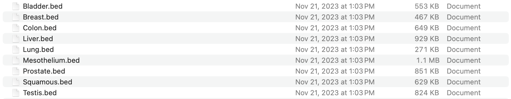
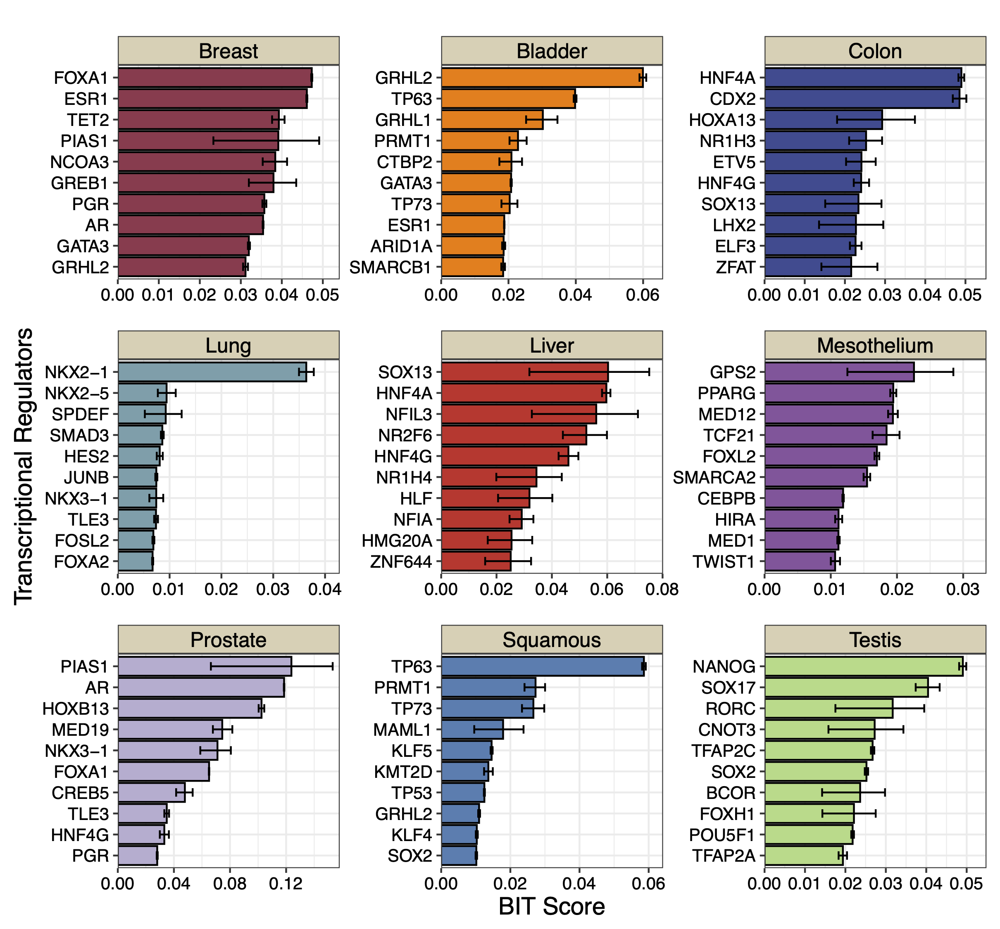
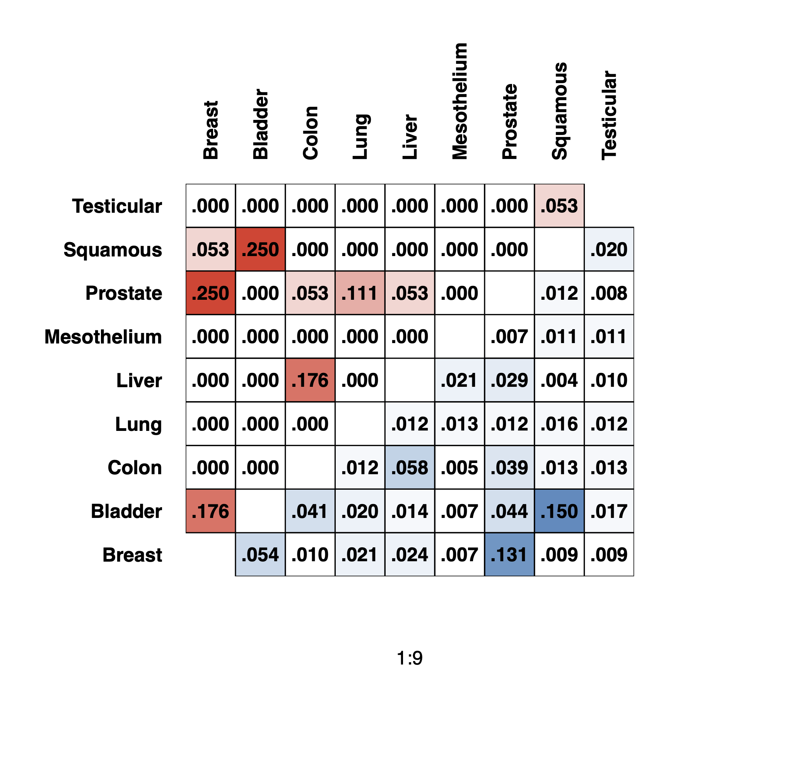
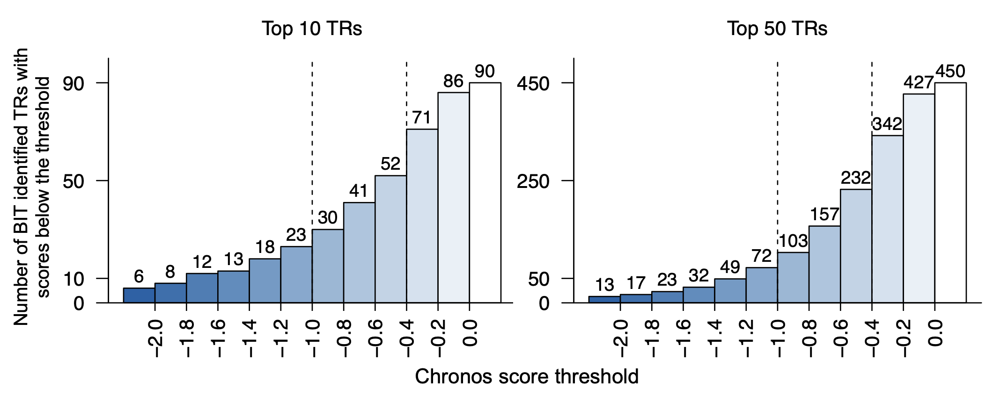
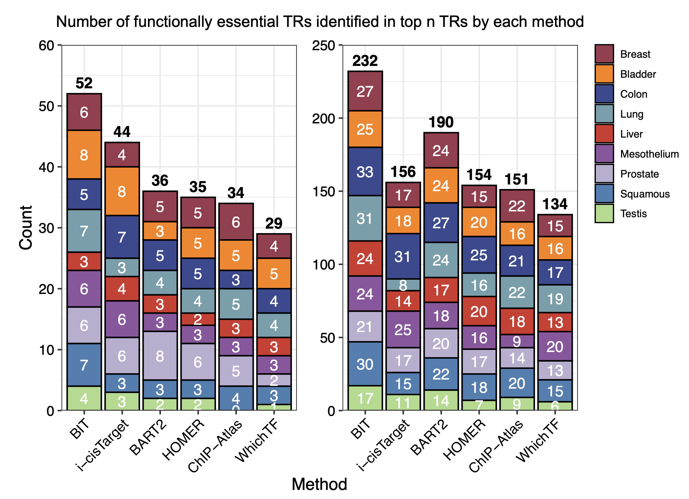

TCGA Cancer-type-specific TRs
=============================

We credit to the data author:

- Corces, M. R. et al. The chromatin accessibility landscape of primary human cancers. Science 362 (2018). `10.1126/science.aav1898 <https://doi.org/10.1126/science.aav1898>`_

The original data was stored in a ``.xlsx`` format, which was first separated and converted to ``.bed`` format. The converted data can be retrieved from `Zenodo <https://zenodo.org/records/13732877>`_.

We apply BIT to each dataset, and plot the top 10 TRs along with their 95% credible intervals.

.. code-block:: r

  work_dir<-"./Cancer/Data/"
  work_files<-list.files(work_dir)
  output_dir<-"./Cancer/bit"

  dir.create(output_dir, showWarnings = FALSE, recursive = TRUE)

  for(i in seq_along(work_files)){
    BIT(paste0(work_dir,work_files[i]),output_dir,plot_bar=FALSE,genome="hg38")
  }

.. code-block:: r

  DATA_DIR<-"./Cancer/bit"

  cancer_files<-list.files(DATA_DIR)
  cancer_files<-cancer_files[c(2,1,3,5,4,6,7,8,9)]
  cancer_names<-sapply(strsplit(cancer_files,".",fixed=TRUE),function(x){return(x[[1]])})

  for(i in 1:9){
    table<-read.csv(paste0(DATA_DIR,cancer_files[i]))
    data<-data.frame(TR=table$TR[1:10],
                     Score=table$BIT_score[1:10],
                     Lower=table$BIT_score_lower[1:10],
                     Upper=table$BIT_score_upper[1:10],
                     group=cancer_names[i])
    data$TR<-factor(data$TR,levels=rev(data$TR))
    plot_list[[i]]<-ggplot(data, aes(x = TR, y = Score)) +
      geom_bar(stat = "identity", fill = colors[i], color = "black") +
      geom_errorbar(aes(ymin = Lower, ymax = Upper), width = 0.4) +
      coord_flip() +
      theme_bw() + scale_y_continuous(limits = c(0, max(data$Upper)+0.005),expand = c(0,0)) + facet_grid(.~group)+
      labs(
        title = "",
        x = "Transcriptional Regulators",
        y = "BIT Score"
      )+theme(title=element_text(size=9),plot.margin=unit(c(0,0.1,0,0.1),"cm"),axis.text.y = element_text(size=10,color="black"),
              axis.text.x = element_text(size=10,color="black"),
              axis.title.x = element_text(size=14,color="black"),
              axis.title.y = element_text(size=14,color="black"),
              strip.background = element_rect(fill="#DBD1B6"),
              strip.text = element_text(size=12, colour="black",margin=ggplot2::margin(1,1,1,1,"mm")))
  }

  p_combined<-plot_list[[1]]+plot_list[[2]]+ plot_list[[3]] +
    plot_list[[4]]+plot_list[[5]]+plot_list[[6]] +
    plot_list[[7]]+plot_list[[8]]+plot_list[[9]]+ plot_layout(ncol=3,guides="collect",axis_titles = "collect")
  print(p_combined)

We can generate the jaccard similarity table as shown in Figure. 3C

.. code-block:: r

  library(BIT)
  work_dir<-"./Cancer/Data/"
  work_dir_bit_results<-"./Cancer/bit/"
  work_files<-list.files(work_dir)
  work_files_bit_results<-list.files(work_dir_bit_results)
  work_files_bit_results

  #reorder the cancer-types
  work_files<-work_files[c(2,1,3,5,4,6,7,8,9)]
  cancer_names<-cancer_names[c(2,1,3,5,4,6,7,8,9)]
  work_files_bit_results<-work_files_bit_results[c(2,1,3,5,4,6,7,8,9)]

  #Define jaccard function
  jaccard<-function(v1,v2){
    return(length(intersect(v1,v2))/length(union(v1,v2)))
  }

  #initialize jaccard table
  jac_table<-matrix(nrow=9,ncol=9)
  rownames(jac_table)<-cancer_names
  colnames(jac_table)<-cancer_names

  #for upper-triangle fill by Jaccard of top 10 TRs BIT identified in each cancer type.
  #for bottom-triangle fill by Jaccard of binarized cancer-type-specific accessible regions.

  for(i in 1:9){
    for(j in 1:9){
      v1<-import_input_regions(paste0(work_dir,work_files[i]),bin_width = 1000, genome = "hg38")
      v2<-import_input_regions(paste0(work_dir,work_files[j]),bin_width = 1000, genome = "hg38")

      table1<-read.csv(paste0(work_dir_bit_results,work_files_bit_results[i]))
      table2<-read.csv(paste0(work_dir_bit_results,work_files_bit_results[j]))

      if(i>j){
        jac_table[i,j]<-jaccard(v1,v2)
      }else if(i<j){
        jac_table[i,j]<-jaccard(table1$TR[1:10],table2$TR[1:10])
      }
    }
  }

  jac_table

.. csv-table:: Jaccard table
   :file: ../tables/Examples/Cancer/jac_table.csv
   :header-rows: 1

We use the following code to generate the heatmap plot:

.. code-block:: r

  create_mask <- function(mat, direction = c("upper", "lower")) {
    direction <- match.arg(direction)
    n <- ncol(mat)
    dummy <- matrix(NA, n, n)  # Create an n x n matrix for dimensions
    mask <- if (direction == "upper") {
      upper.tri(dummy)
    } else {
      lower.tri(dummy)
    }
    mask[!mask] <- NA
    mask
  }

  # Generate a heatmap matrix by masking the table based on the specified triangle
  plot_heatmap <- function(tbl, direction = "upper") {
    as.matrix(tbl) * create_mask(tbl, direction)
  }

  # Draw rectangles with overlaid formatted text for cells in the specified triangle
  draw_rect <- function(n, table, direction = c("upper", "lower")) {
    direction <- match.arg(direction)
    condition <- if (direction == "upper") {
      function(i, j) j > i
    } else {
      function(i, j) j < i
    }
    for (i in 1:n) {
      for (j in 1:n) {
        if (condition(i, j)) {
          rect(i - 0.5, j - 0.5, i + 0.5, j + 0.5, lwd = 1)
          formatted <- sprintf("%.3f", table[i, j])
          number <- sub("^0+", "", formatted)
          text(i, j, number, col = "black", cex = 1, font = 2)
        }
      }
    }
  }

  # Plotting parameters and drawing the heatmaps with overlayed annotations
  collab <- "black"
  par(mfrow = c(1, 1), oma = c(2, 2, 2, 2), mar = c(6, 6, 6, 5))

  # Plot the upper triangle heatmap
  image(1:9, 1:9, plot_heatmap(jac_table, "upper"), ylab = "", axes = FALSE,
        col = colorRampPalette(c("#FFFFFF", "#EE4431"))(20))

  # Overlay the lower triangle heatmap
  image(1:9, 1:9, plot_heatmap(jac_table, "lower"), ylab = "", axes = FALSE, add = TRUE,
        col = colorRampPalette(c("#FFFFFF", "#4C8BC0"))(20))

  # Draw rectangles and add text for both triangles
  draw_rect(9, jac_table, "upper")
  draw_rect(9, jac_table, "lower")

  # Add axis labels
  axis(3, at = 1:9, labels = colnames(jac_table)[1:9], las = 2, lty = 0, tck = 0,
       cex.axis = 1, tcl = -0.2, font.axis = 2, col.axis = collab)
  axis(2, at = 1:9, labels = colnames(jac_table)[1:9], las = 1, lty = 0, tck = 0,
       cex.axis = 1, tcl = -0.2, font.axis = 2, col.axis = collab)

To contrast with the DepMap CRISPR/cas9 TR knock-out screen data, we need extra datasets ``CRISPRGeneEffect.csv`` and ``Model.csv``, which are now available on updated `Zenodo <https://zenodo.org/records/13732877>`_ data, in the folder of ``/DepMap/``.

.. code-block:: r

  crispr_gene_effect<-as.data.frame(fread("./DepMap/CRISPRGeneEffect.csv"))
  colnames(crispr_gene_effect)<-sapply(strsplit(colnames(crispr_gene_effect)," ",fixed=TRUE),function(x){return(x[[1]])})
  Model<-read.csv("./DepMap/CRISPR/Model.csv")

  #Filter out the cell lines belong to specific cancer type
  cluster_code<-list("Breast"=c("BRCA"),
                     "Bladder"=c("BLCA"),
                     "Colon"=c("COAD"),
                     "Liver"=c("HCC"),
                     "Lung"=c("LUAD"),
                     "Mesothelium"=c("PLBMESO","PLEMESO","PLMESO"),
                     "Prostate"=c("PRAD"),
                     "Squamous"=c("HNSC","LUSC","ESCA","CESC"),
                     "Testis"=c("EMBCA","TT")
  )

  model_ids_func<-function(x){
    model_ids<-c()
    for(i in seq_along(x)){
      model_ids<-c(model_ids,Model$ModelID[which(Model$OncotreeCode==x[i])])
    }
    return(model_ids)
  }

  Model_ids<-lapply(cluster_code, model_ids_func)

Once we have the CRISPR/cas9 data, we can first replicate the Figure. 4D to show the total number of TRs ranked to top 10 / top 50 by putting a thrshold on Chronos score.

.. code-block:: r

  stepss<-seq(-2,0,0.2)
  length(stepss)
  start_color<-"#1663A9"
  end_color<-"#FFFFFF"
  color_palette <- colorRampPalette(c(start_color, end_color))
  colors<-color_palette(length(stepss)+1)

  mini_scores<-c()
  method_tf<-bit_table

  TR_TOP_10_thres_TABLE<-data.frame(matrix(ncol=9,nrow=11))
  TR_TOP_50_thres_TABLE<-data.frame(matrix(ncol=9,nrow=11))

  for(i in 1:9){
    model_ids<-Model_ids[[i]]
    cancer_name<-names(cluster_code)[i]
    subtable_10<-crispr_gene_effect[which(crispr_gene_effect$ModelID%in%model_ids),method_tf[which(method_tf[1:10,cancer_name]%in%colnames(crispr_gene_effect)),cancer_name]]
    subtable_50<-crispr_gene_effect[which(crispr_gene_effect$ModelID%in%model_ids),method_tf[which(method_tf[1:50,cancer_name]%in%colnames(crispr_gene_effect)),cancer_name]]
    vec_min_10<-c()
    for(k in 1:ncol(subtable_10)){
      vec_min_10<-c(c(vec_min_10,min(subtable_10[,k])))
    }
    vec_min_50<-c()
    for(k in 1:ncol(subtable_50)){
      vec_min_50<-c(c(vec_min_50,min(subtable_50[,k])))
    }
    for(j in 1:length(stepss)){
      TR_TOP_10_thres_TABLE[j,i]<-sum(vec_min_10<=(stepss[j]),na.rm=TRUE)
      TR_TOP_50_thres_TABLE[j,i]<-sum(vec_min_50<=(stepss[j]),na.rm=TRUE)
    }
  }

  #10
  cumsums<-rowSums(TR_TOP_10_thres_TABLE)
  cumsums<-c(cumsums,90)
  cumsums
  bp1<-barplot(cumsums,space=0,col=colors,axes=FALSE,ylim=c(0,100),xaxt="n")
  box(bty="l")
  text(bp,cumsums+5,cumsums,cex=0.9,font=1)
  tick_positions<-bp+0.5
  axis(1,at=tick_positions[1:11],format(stepss,nsmall=1),las=3,cex=1.3)
  axis(2,at=c(0,10,50,90),c(0,10,50,90),las=2,cex.axis=1)
  abline(v=6,xpd=FALSE,lty=2)
  abline(v=9,xpd=FALSE,lty=2)
  title(main="Top 10 TRs",cex.main=1,font.main=1,line=1)

  #50
  cumsums<-c(rowSums(TR_TOP_50_thres_TABLE),450)
  bp2<-barplot(cumsums,space=0,col=colors,axes=FALSE,ylim=c(0,500),bty="l")
  text(bp,cumsums+25,cumsums,cex=0.9,font=1)
  box(bty="l")
  tick_positions<-bp+0.5
  axis(1,at=tick_positions[1:11],format(stepss,nsmall=1),las=3,cex=1.3)
  axis(2,at=c(0,50,250,450),c(0,50,250,450),las=2,cex=1.3)
  abline(v=6,xpd=FALSE,lty=2)
  abline(v=9,xpd=FALSE,lty=2)
  title(main="Top 50 TRs",cex.main=1,font.main=1,line=1)
  title(xlab = "Chronos score threshold",ylab="Number of BIT identified TRs with\nscores below the threshold",outer = TRUE,line=1)

.. code-block:: r

Next, we apply state-of-the-art methods to analyze the generated ``*.bed`` files and extract outputs from each method. The following tools are used:

`BART2 <https://github.com/zanglab/bart2?tab=readme-ov-file>`_

`HOMER <http://homer.ucsd.edu/homer/ngs/peakMotifs.html>`_

`WhichTF <https://bitbucket.org/bejerano/whichtf/src/master/>`_

`ChIP-Atlas <https://chip-atlas.org>`_

`i-cisTarget <https://gbiomed.kuleuven.be/apps/lcb/i-cisTarget/>`_

The analysis begins by collecting outputs from each method.

Before proceeding, we need to preprocess the results from HOMER and i-cisTarget, HOMER outputs may contain aliases for known TRs, while i-cisTarget results are provided in HTML format, requiring manual extraction of relevant data:

For i-cisTarget:

.. code-block:: r

  library(rvest)
  library(stringr)

  work_dir<-"./Cancer/icistarget/"
  work_files<-list.files(work_dir)

  icistarget_result<-data.frame(matrix(nrow=500,ncol=9))
  cancer_names<-sapply(strsplit(work_files,".",fixed=TRUE),function(x){return(x[[1]])})
  colnames(icistarget_result)<-cancer_names
  icistarget_result

  for(j in 1:length(work_files)){
    html <- read_html(paste0(work_dir,work_files[j]))
    rows <- html %>% html_nodes('tr')
    ids <- c()
    descriptions <- c()
    tfs_list <- list()

    # Loop through each row
    for (i in 13:length(rows)) {
      # Extract the ID
      id_value <- rows[i] %>% html_node('td') %>% html_text() %>% str_trim()

      # Extract the description and TFs
      td_content <- rows[i] %>% html_nodes('td') %>% .[2] %>% html_text() %>% str_trim()
      description <- str_extract(td_content, "Description:.*Possible TFs:") %>%
        str_remove("Description:") %>% str_remove("Possible TFs:") %>% str_trim()
      tfs <- str_extract(td_content, "Possible TFs:.*") %>%
        str_remove("Possible TFs:") %>% str_trim() %>% str_split(", ") %>% unlist()

      # Append to vectors
      ids <- c(ids, id_value)
      descriptions <- c(descriptions, description)
      tfs_list[[i-12]] <- tfs
    }

    # Ensure tfs_list is a list of character vectors
    tfs_list <- lapply(tfs_list, function(x) if (length(x) == 0) NA else x)

    tfs_list

    # Create a data frame
    df <- data.frame(
      ID = rep(ids, sapply(tfs_list, length)),
      Description = rep(descriptions, sapply(tfs_list, length)),
      Possible_TFs = unlist(tfs_list)
    )
    # Remove rows with NA in Possible_TFs
    df <- df %>% filter(!is.na(Possible_TFs))
    uniqueTFs<-unique(df$Possible_TFs)
    icistarget_result[1:length(uniqueTFs),j]<-uniqueTFs
  }
  icistarget_result
  write.csv(icistarget_result,"./Cancer/icistarget/icistarget_result.csv")

For HOMER:

.. code-block:: r

  work_dir_homer<-"./Cancer/HOMER_results/"
  work_sub_dir<-list.files(work_dir_homer)
  cancer_names<-sapply(strsplit(work_sub_dir,".",fixed=TRUE),function(x){return(x[[1]])})

  HGNC_symbol_converter<-c("AMYB"="MYBL1","AP-2alpha"="TFAP2A","AP-2gamma"="TFAP2C","AP4"="TFAP4","Boris"="CTCFL","Brn1"="POU3F3",
  "Brn2"="POU3F2","brachyury"="TBXT","c-Jun-CRE"="JUN","c-Myc"="MYC","CArG"="IER5","COUP-TFII"="NR2F2","Chop"="DDIT3",
  "E-box"="ZEB1","Erra"="ESRRA","ERRg"="ESRRG","ETS:RUNX"="RUNX1","EWS:FLI1-fusion"="FLI1","FXR"="NR1H4","NFAT"="NFATC","NFkB-p50,p52"="NFKB1,NFKB2","NFkB-p65"="RELA",
  "NFkB-p65-Rel"="RELA","NFY"="NFYA,NFYB,NFAC","Nur77"="NR4A1","OCT4-SOX2-TCF-NANOG"="OCT4,SOX2,TCF,NANOG","Oct4:Sox17"="OCT4,SOX17","p53"="TP53","p63"="TP63","p73"="TP73",
  "Pit1"="POU2F1","PSE"="SNAPC2","PU.1"="SPI1","RAR:RXR"="RXRA","Reverb"="NR1D2","BORIS"="CTCFL","LXRE"="NR1H3")

  homer_results<-data.frame(matrix(ncol=length(cancer_names),nrow=500))
  colnames(homer_results)<-cancer_names

  for(i in 1:ncol(homer_results)){
  	testdf<-read.table(paste0(work_dir_homer,work_sub_dir[i],"/knownResults.txt"),row.names=NULL)
  	TF_names<-sapply(strsplit(testdf$row.names,"(",fixed=TRUE),function(x){return(x[[1]])})
  	indices<-which(TF_names%in%names(HGNC_symbol_converter))
  	TF_names[indices]<-HGNC_symbol_converter[TF_names[indices]]
  	TF_names<-toupper(TF_names)
  	TF_names<-sapply(strsplit(TF_names,":",fixed=TRUE),function(x){return(x[[1]])})
  	TF_names<-sapply(strsplit(TF_names,"/",fixed=TRUE),function(x){return(x[[1]])})
  	TF_names<-str_replace_all(TF_names,"\\.", "-")

  	homer_results[1:length(TF_names),i]<-TF_names
  }
  homer_results
  write.csv(icistarget_result,"./Cancer/homer/homer_result.csv")

We summarize the extracted data from other tables and merge the results into a unified list:

.. code-block:: r

  #################Cancer
  work_dir_cancer<-"./Cancer"

  #################bart2
  bart2_files<-list.files(paste0(work_dir_cancer,"/bart2"))

  bart2_table<-data.frame(matrix(nrow=1000,ncol=9))
  cancer_names<-c("Breast","Bladder","Colon","Liver","Lung","Mesothelium","Prostate","Squamous","Testis")
  colnames(bart2_table)<-cancer_names
  for(i in seq_along(cancer_names)){
    df<-read.table(paste0(work_dir_cancer,"bart2/",cancer_names[i],"_bart_results.txt"),sep="\t",header=TRUE)
    bart2_table[1:nrow(df),cancer_names[i]]<-df$TF
  }

  bart2_table

  #################homer
  homer_table<-read.csv(paste0(work_dir_cancer,"homer/homer_result.csv"))
  homer_table

  #################icistarget
  icistarget_table<-read.csv(paste0(work_dir_cancer,"icistarget/icistarget_result.csv"),row.names=1)
  icistarget_table

  #################whichtf
  whichtf_files<-list.files(paste0(work_dir_cancer,"/whichtf"))
  whichtf_files

  whichtf_table<-data.frame(matrix(nrow=1000,ncol=9))
  cancer_names<-sapply(strsplit(whichtf_files,".",fixed=TRUE),function(x){return(x[[1]])})
  colnames(whichtf_table)<-cancer_names

  for(i in seq_along(cancer_names)){
    df<-read.table(paste0(work_dir_cancer,"/whichtf/",cancer_names[i],".tsv"),sep="\t",header=TRUE)
    whichtf_table[1:nrow(df),cancer_names[i]]<-df$TF
  }

  whichtf_table

  #################chipatlas

  #calculate mean ranks of TRs
  avg_rank<- function(x) {
    unique_elements <- unique(x)
    mean_ranks <- sapply(unique_elements, function(u) mean(which(x == u)))
    setNames(mean_ranks, unique_elements)
    return(names(mean_ranks)[order(mean_ranks)])
  }

  chipatlas_files<-list.files(paste0(work_dir_cancer,"chipatlas/"))
  chipatlas_files

  chip_atlas_table<-data.frame(matrix(nrow=2000,ncol=9))
  cancer_names<-sapply(strsplit(chipatlas_files,".",fixed=TRUE),function(x){return(x[[1]])})
  colnames(chip_atlas_table)<-cancer_names

  for(i in seq_along(cancer_names)){
    df<-read.table(paste0(work_dir_cancer,"chipatlas/",cancer_names[i],".tsv"),sep="\t",header=FALSE)
    TRs_Avg_Rank<-avg_rank(df$V3)
    chip_atlas_table[1:length(TRs_Avg_Rank),cancer_names[i]]<-TRs_Avg_Rank
  }

  #################bit
  bit_files<-list.files(paste0(work_dir_cancer,"bit"))
  bit_files

  bit_table<-data.frame(matrix(nrow=1000,ncol=9))
  cancer_names<-sapply(strsplit(bit_files,".",fixed=TRUE),function(x){return(x[[1]])})
  colnames(bit_table)<-cancer_names
  for(i in seq_along(cancer_names)){
    df<-read.csv(paste0(work_dir_cancer,"bit/",cancer_names[i],".csv"), header=TRUE,row.names=NULL)
    bit_table[1:nrow(df),cancer_names[i]]<-df$TR
  }

  bit_table

  ##################
  whichtf_table
  bart2_table
  bit_table
  icistarget_table
  homer_table
  chip_atlas_table

  table_lists<-list("BIT"=bit_table,
                    "BART2"=bart2_table,
                    "ChIP-Atlas"=chip_atlas_table,
                    "HOMER"=homer_table,
                    "i-cisTarget"=icistarget_table,
                    "WhichTF"=whichtf_table)

We next contrat the results of BIT with the results from other state-of-the-art methods based on Chronos score threshold :math:`-0.4`:

.. code-block:: r

  TR_TOP_10_TABLE<-data.frame(matrix(ncol=9,nrow=6))
  TR_TOP_50_TABLE<-data.frame(matrix(ncol=9,nrow=6))
  rownames(TR_TOP_10_TABLE)<-names(table_lists)
  rownames(TR_TOP_50_TABLE)<-names(table_lists)
  colnames(TR_TOP_10_TABLE)<-names(cluster_code)
  colnames(TR_TOP_50_TABLE)<-names(cluster_code)

  for(i in 1:9){
    model_ids<-Model_ids[[i]]
    cancer_name<-names(cluster_code)[i]
    for(j in 1:6){
      method_tf<-table_lists[[j]]
      subtable_10<-crispr_gene_effect[which(crispr_gene_effect$ModelID%in%model_ids),method_tf[which(method_tf[1:10,cancer_name]%in%colnames(crispr_gene_effect)),cancer_name]]
      subtable_50<-crispr_gene_effect[which(crispr_gene_effect$ModelID%in%model_ids),method_tf[which(method_tf[1:50,cancer_name]%in%colnames(crispr_gene_effect)),cancer_name]]
      vec_min_10<-c()
      for(k in 1:ncol(subtable_10)){
        vec_min_10<-c(c(vec_min_10,min(subtable_10[,k])))
      }
      vec_min_50<-c()
      for(k in 1:ncol(subtable_50)){
        vec_min_50<-c(c(vec_min_50,min(subtable_50[,k])))
      }
      TR_TOP_10_TABLE[j,i]<-sum(vec_min_10<=(-0.4),na.rm=TRUE)
      TR_TOP_50_TABLE[j,i]<-sum(vec_min_50<=(-0.4),na.rm=TRUE)
    }
  }

  rowSums(TR_TOP_10_TABLE)
  rowSums(TR_TOP_50_TABLE)
  TR_TOP_50_TABLE
  TR_TOP_10_TABLE

  #> TR_TOP_50_TABLE
  #            Breast Bladder Colon Liver Lung Mesothelium Prostate Squamous Testis      Method
  #BIT             27      25    33    24   31          24       21       30     17         BIT
  #BART2           24      24    27    17   24          18       20       22     14       BART2
  #ChIP-Atlas      22      16    21    18   22           9       14       20      9  ChIP-Atlas
  #HOMER           15      20    25    20   16          16       17       18      7       HOMER
  #i-cisTarget     17      18    31    14    8          25       17       15     11 i-cisTarget
  #WhichTF         15      16    17    13   19          20       13       15      6     WhichTF
  #> TR_TOP_10_TABLE
  #            Breast Bladder Colon Liver Lung Mesothelium Prostate Squamous Testis      Method
  #BIT              6       8     5     3    7           6        6        7      4         BIT
  #BART2            5       3     5     3    4           3        8        3      2       BART2
  #ChIP-Atlas       6       5     3     3    5           3        5        4      0  ChIP-Atlas
  #HOMER            5       5     5     2    4           3        6        3      2       HOMER
  #i-cisTarget      4       8     7     4    3           6        6        3      3 i-cisTarget
  #WhichTF          4       5     4     3    4           3        2        3      1     WhichTF

Next we plot the stacked barplot to show the total number of functionally essential TRs identified by each method:

.. code-block:: r

  TR_TOP_10_TABLE$Method<-rownames(TR_TOP_10_TABLE)
  df_long <- pivot_longer(TR_TOP_10_TABLE,
                          cols = -Method,    # all columns except 'method'
                          names_to = "cancer",
                          values_to = "count")

  colors<-c("#9B3A4D","#FC8002","#394A92","#70A0AC","#D2352C","#8E549E","#BAAFD1","#497EB2","#ADDB88")

  df_long$Method<-factor(df_long$Method,levels=c("BIT","i-cisTarget","BART2","HOMER","ChIP-Atlas","WhichTF"))
  df_long$cancer<-factor(df_long$cancer,levels=c("Breast","Bladder","Colon","Lung","Liver","Mesothelium","Prostate","Squamous","Testis"))
  df_totals <- df_long %>%
    group_by(Method) %>%
    summarise(total = sum(count))

  p1<-ggplot(df_long, aes(x = Method, y = count, fill = cancer)) +
    # Create the stacked bars with a black outline for each segment
    geom_bar(stat = "identity", color = "black", position = "stack") +
    # Add text labels for the count of each cancer in the stacked segments
    geom_text(aes(label = count),
              position = position_stack(vjust = 0.5),
              color = "white") +
    # Add the total sum above each bar in bold
    geom_text(data = df_totals,
              aes(x = Method, y = total, label = total),
              inherit.aes = FALSE,
              vjust = -0.5,  # Adjust this value as needed for spacing
              fontface = "bold") +
    # Remove extra space from the y-axis (starting at 0)
    scale_y_continuous(expand = c(0, 0),limits=c(0,60)) +
    # Manually assign specific colors for each cancer type.
    scale_fill_manual(values = c("Breast"      = "#9B3A4D",
                                 "Bladder"     = "#FC8002",
                                 "Colon"       = "#394A92",
                                 "Liver"       = "#D2352C",
                                 "Lung"        = "#70A0AC",
                                 "Mesothelium" = "#8E549E",
                                 "Prostate"    = "#BAAFD1",
                                 "Squamous"    = "#497EB2",
                                 "Testis"      = "#ADDB88")) +
    labs(x = "Method",
         y = "Count",
         title = "") +
    theme_bw()+theme(axis.text.x=element_text(angle=45,color="black",size=10,hjust=1),
                     axis.text.y=element_text(size=10,color="black"),
                     axis.title.x=element_text(size=12,color="black"),
                     axis.title.y=element_text(size=12,color="black"))

  TR_TOP_50_TABLE$Method<-rownames(TR_TOP_50_TABLE)

  df_long <- pivot_longer(TR_TOP_50_TABLE,
                          cols = -Method,    # all columns except 'method'
                          names_to = "cancer",
                          values_to = "count")

  colors<-c("#9B3A4D","#FC8002","#394A92","#70A0AC","#D2352C","#8E549E","#BAAFD1","#497EB2","#ADDB88")

  df_long$Method<-factor(df_long$Method,levels=c("BIT","i-cisTarget","BART2","HOMER","ChIP-Atlas","WhichTF"))
  df_long$cancer<-factor(df_long$cancer,levels=c("Breast","Bladder","Colon","Lung","Liver","Mesothelium","Prostate","Squamous","Testis"))
  df_totals <- df_long %>%
    group_by(Method) %>%
    summarise(total = sum(count))

  p2<-ggplot(df_long, aes(x = Method, y = count, fill = cancer)) +
    # Create the stacked bars with a black outline for each segment
    geom_bar(stat = "identity", color = "black", position = "stack") +
    # Add text labels for the count of each cancer in the stacked segments
    geom_text(aes(label = count),
              position = position_stack(vjust = 0.5),
              color = "white") +
    # Add the total sum above each bar in bold
    geom_text(data = df_totals,
              aes(x = Method, y = total, label = total),
              inherit.aes = FALSE,
              vjust = -0.5,  # Adjust this value as needed for spacing
              fontface = "bold") +
    # Remove extra space from the y-axis (starting at 0)
    scale_y_continuous(expand = c(0, 0),limits=c(0,250)) +
    # Manually assign specific colors for each cancer type.
    scale_fill_manual(values = c("Breast"      = "#9B3A4D",
                                 "Bladder"     = "#FC8002",
                                 "Colon"       = "#394A92",
                                 "Liver"       = "#D2352C",
                                 "Lung"        = "#70A0AC",
                                 "Mesothelium" = "#8E549E",
                                 "Prostate"    = "#BAAFD1",
                                 "Squamous"    = "#497EB2",
                                 "Testis"      = "#ADDB88")) +
    labs(x = "Method",
         y = "Count",
         title = "") +
    theme_bw()+theme(axis.text.x=element_text(angle=45,color="black",size=10,hjust=1),
                     axis.text.y=element_text(size=10,color="black"),
                     axis.title.x=element_text(size=12,color="black"),
                     axis.title.y=element_text(size=12,color="black"))
  library(patchwork)

  plot_comb<-p1 + p2 + plot_layout(ncol=2,guides="collect",axes="collect")
  print(plot_comb)

