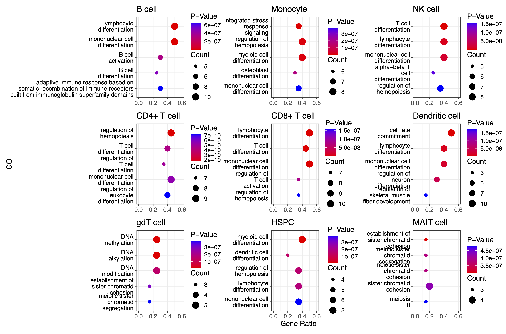

10xGenomics PBMCs cell-type-specific TRs
========================================

We utilize SnapATAC2 to process single-cell ATAC-seq (scATAC-seq) data obtained from `10xGENOMICS <https://support.10xgenomics.com/single-cell-multiome-atac-gex/datasets/1.0.0/pbmc_granulocyte_sorted_10k>`_. . The detailed usage guide for SnapATAC2 can be found in the `SnapATAC2-manual <https://kzhang.org/SnapATAC2/tutorials/index.html>`_. We used **SnapATAC2 v2.6.0** for our analysis.

For improved efficiency, some steps require a GPU to accelerate model training.

.. code-block:: python

  # -----------------------------
  # Import Required Libraries
  # -----------------------------
  import warnings
  warnings.filterwarnings("ignore")  # Ignore warning messages for cleaner output

  import snapatac2 as snap         # Library for scATAC-seq analysis
  import anndata as ad             # Handling annotated data matrices
  import pandas as pd              # Data manipulation and analysis
  import scanpy as sc              # Single-cell analysis package
  import scvi                     # Probabilistic modeling for single-cell omics data
  import os                       # For directory operations
  import matplotlib.pyplot as plt # For plotting

  # -----------------------------
  # Set Global Settings & Seed
  # -----------------------------
  scvi.settings.seed = 2          # Set random seed for reproducibility
  print("i")                     # Print a simple indicator (optional)

  # -----------------------------
  # Data Loading and Preprocessing
  # -----------------------------
  # Load a reference dataset from the provided multiome dataset
  reference = snap.read(snap.datasets.pbmc10k_multiome(), backed=None)

  # Load an ATAC dataset from a local file
  atac = snap.read("./10XGENOMICS/pbmc.h5ad", backed=None)

  # Generate a gene expression matrix from the ATAC dataset using gene annotations for hg38
  query = snap.pp.make_gene_matrix(atac, gene_anno=snap.genome.hg38)

  # Initialize the cell type annotation for the query dataset as missing values
  query.obs['cell_type'] = pd.NA

  # Concatenate the reference and query datasets into one AnnData object
  data = ad.concat(
      [reference, query],
      join='inner',                # Keep only features present in both datasets
      label='batch',               # Create a batch label to differentiate datasets
      keys=["reference", "query"],
      index_unique='_'
  )

  # -----------------------------
  # Filter and Identify Highly Variable Genes
  # -----------------------------
  sc.pp.filter_genes(data, min_cells=5)  # Keep genes expressed in at least 5 cells

  # Identify and subset to the top 5000 highly variable genes using Seurat v3 method
  sc.pp.highly_variable_genes(
      data,
      n_top_genes=5000,
      flavor="seurat_v3",
      batch_key="batch",  # Consider batch effects when identifying variable genes
      subset=True
  )

  # -----------------------------
  # Setup and Train SCVI Model
  # -----------------------------
  # Configure the AnnData object for SCVI with batch key
  scvi.model.SCVI.setup_anndata(data, batch_key="batch")

  # Initialize the SCVI model with 2 layers and 30 latent dimensions
  vae = scvi.model.SCVI(
      data,
      n_layers=2,
      n_latent=30,
      gene_likelihood="nb",     # Negative binomial likelihood for gene expression
      dispersion="gene-batch"   # Model dispersion per gene and batch
  )

  # Train the SCVI model (using early stopping to prevent overfitting)
  vae.train(max_epochs=2000, early_stopping=True)

  # -----------------------------
  # Prepare Data for SCANVI
  # -----------------------------
  # Initialize a new column for cell type labels with a default value 'Unknown'
  data.obs["celltype_scanvi"] = 'Unknown'

  # Identify the reference cells (where batch is "reference")
  ref_idx = data.obs['batch'] == "reference"
  # For reference cells, assign the known cell type labels
  data.obs["celltype_scanvi"][ref_idx] = data.obs['cell_type'][ref_idx]

  # Initialize the SCANVI model using the pretrained SCVI model and provided labels
  lvae = scvi.model.SCANVI.from_scvi_model(
      vae,
      adata=data,
      labels_key="celltype_scanvi",
      unlabeled_category="Unknown"
  )

  # Train the SCANVI model further with a maximum of 2000 epochs and sample 100 cells per label
  lvae.train(max_epochs=2000, n_samples_per_label=100)

  # -----------------------------
  # Obtain Predictions and Latent Representation
  # -----------------------------
  # Predict cell type labels using SCANVI and store the predictions in a new column
  data.obs["C_scANVI"] = lvae.predict(data)
  # Get the latent representation from SCANVI for downstream analysis and visualization
  data.obsm["X_scANVI"] = lvae.get_latent_representation(data)

  # -----------------------------
  # Compute UMAP Embedding
  # -----------------------------
  # Compute the nearest neighbors using the SCANVI latent representation
  sc.pp.neighbors(data, use_rep="X_scANVI")
  # Calculate UMAP coordinates for visualization
  sc.tl.umap(data)

  # Save the processed AnnData object with UMAP embedding to disk (compressed)
  data.write("./10XGENOMICSpbmc10k.h5ad", compression="gzip")

  # -----------------------------
  # Annotate ATAC Data with Predicted Cell Types
  # -----------------------------
  # Map predicted cell type labels from the integrated data to the original ATAC dataset
  atac.obs['cell_type'] = data.obs.loc[atac.obs_names + '_query']['C_scANVI'].to_numpy()

  # -----------------------------
  # Merge Similar Cell Types
  # -----------------------------
  # Define a mapping dictionary to merge similar cell type annotations
  mapping_dict = {
      'CD4 Naive': 'CD4+ cell',
      'CD4 TCM': 'CD4+ cell',
      'CD4 TEM': 'CD4+ cell',
      'Treg': 'CD4+ cell',
      'CD8 Naive': 'CD8+ cell',
      'CD8 TEM_1': 'CD8+ cell',
      'CD8 TEM_2': 'CD8+ cell',
      'Naive B': 'B cell',
      'Intermediate B': 'B cell',
      'Memory B': 'B cell',
      'Plasma': 'B cell',
      'NK': 'NK cell',
      'cDC': 'Dendritic cell',
      'pDC': 'Dendritic cell',
      'CD14 Mono': 'Monocyte',
      'CD16 Mono': 'Monocyte',
      'HSPC': 'HSPC',
      'MAIT': 'MAIT cell',
      'gdT': 'gdT cell'
  }

  # Save the ATAC data with annotations
  atac.write("./10XGENOMICS/pbmc10k_annotated.h5ad", compression="gzip")

  # Map the cell type labels in the integrated data using the provided dictionary
  data.obs["Cell_Types"] = data.obs["cell_type"].map(mapping_dict)

  # -----------------------------
  # Peak Calling and Matrix Generation
  # -----------------------------
  # Run MACS3 peak calling on the data grouped by merged cell types
  snap.tl.macs3(data, groupby='Cell_Types')
  # Merge peaks across groups using hg38 annotations
  peaks = snap.tl.merge_peaks(data.uns['macs3'], snap.genome.hg38)
  # Create a peak accessibility matrix using the merged peaks
  peak_mat = snap.pp.make_peak_matrix(data, use_rep=peaks['Peaks'])

  # Create a new directory to save CSV outputs, using the current seed in the folder name
  os.mkdir("./10XGENOMICS/csv/scATAC_Peaks_" + str(scvi.settings.seed))

  # -----------------------------
  # Set Plotting Parameters for High Resolution
  # -----------------------------
  plt.rcParams['figure.dpi'] = 1000    # High resolution for displaying figures
  plt.rcParams['savefig.dpi'] = 1000   # High resolution for saving figures
  plt.rcParams['figure.figsize'] = [8, 8]  # Set default figure size

  # -----------------------------
  # UMAP Plotting of Cell Types
  # -----------------------------
  # Compute UMAP embedding with a fixed random state for reproducibility
  snap.tl.umap(data, random_state=15)

  # Plot the UMAP embedding colored by cell types with custom styling
  sc.pl.umap(
      data,
      color="Cell_Types",
      size=15,                # Increase point size for visibility
      alpha=0.9,              # Slight transparency to visualize density
      legend_fontsize=20,
      legend_fontweight='bold',
      frameon=True,           # Display the frame for clarity
      ncols=2,                # Organize legend into two columns
      show=False,
      save='umap_plot_Test.pdf'
  )

  # -----------------------------
  # Process and Save Gene Expression Matrix
  # -----------------------------
  # Create a gene expression matrix using hg38 annotations
  gene_matrix = snap.pp.make_gene_matrix(data, snap.genome.hg38)
  print(gene_matrix)

  # Filter genes expressed in fewer than 5 cells
  sc.pp.filter_genes(gene_matrix, min_cells=5)
  # Normalize total counts per cell
  sc.pp.normalize_total(gene_matrix)
  # Log-transform the normalized counts
  sc.pp.log1p(gene_matrix)

  # Apply MAGIC imputation (approximate solver) to smooth gene expression data
  sc.external.pp.magic(gene_matrix, solver="approximate")
  # Transfer UMAP coordinates from 'data' to gene_matrix for consistent visualization
  gene_matrix.obsm["X_umap"] = data.obsm["X_umap"]

  # Save the processed gene matrix to disk (compressed)
  gene_matrix.write("pbmc10k_gene_mat.h5ad", compression='gzip')

  # Set global figure parameters for scanpy plots
  sc.set_figure_params(scanpy=True, dpi=1000, dpi_save=1000, fontsize=24, figsize=[10, 10])

  # -----------------------------
  # Plot Marker Genes on UMAP
  # -----------------------------
  marker_genes = []  # Define marker genes to visualize on UMAP (fill in with gene names)

  # Reload the gene matrix to ensure data consistency
  gene_matrix = snap.read("pbmc10k_gene_mat.h5ad", backed=None)

  # Loop through each marker gene and plot its expression on the UMAP
  for i in range(len(marker_genes)):
      sc.pl.umap(
          gene_matrix,
          use_raw=False,
          color=marker_genes[i],
          size=15,                # Increase point size for better visibility
          alpha=0.9,              # Slight transparency to indicate density
          frameon=True,           # Show a frame around the plot
          ncols=5,                # Organize legends into 5 columns if needed
          show=False,
          save='umap_plot_Test_UMAP_PBMCs_' + marker_genes[i] + '.pdf',
          color_map="plasma"      # Use the 'plasma' color map for gene expression
      )

The previous pipeline can generate the below UMAP plots:

Colored by cell types:

.. image:: ../images/Examples/singlecell/Pic1.png

Colored by PAX5 gene activity:

.. image:: ../images/Examples/singlecell/Pic2.png

We also get the marker peaks of each cell type:

.. code-block:: python

  marker_peaks=snap.tl.marker_regions(peak_mat, groupby='Cell_Types', pvalue=0.01)
  for keys in marker_peaks.keys():
          elements=marker_peaks[keys]
          chromosomes = []
          starts = []
          ends = []
          for element in elements:
              # Split each element into chromosome, start, and end
              chromosome, positions = element.split(':')
              start, end = positions.split('-')
              # Append the results to the corresponding lists
              chromosomes.append(chromosome)
              starts.append(start)
              ends.append(end)
          df = pd.DataFrame({'Chrom': chromosomes,'Start': starts,'End': ends})
          df.to_csv("./10XGENOMICS/csv/scATAC_Peaks_"+scvi.settings.seed+"/"+keys.replace(" ","_")+".csv",index=False)
      print("./10XGENOMICS/csv/scATAC_Peaks_"+scvi.settings.seed+" Done")

cell-type-specific marker regions:

.. image:: ../images/Examples/singlecell/Pic3.png

We run BIT on each of the region set:

.. code-block:: r

  work_dir<-"./10XGENOMICS/csv/"
  work_files<-list.files(work_dir)
  output_path<-"./10XGENOMICS/bit/"
  dir.create(output_path, showWarnings = FALSE, recursive = TRUE)
  for(i in seq_along(work_files)){
    BIT(paste0(work_dir,work_files[i]), output_path=output_dir, format="csv", bin_width=1000, genome="hg38")
  }

We plot the top 10 TRs identified by BIT in each cell type along with the 95% credible intervals:

.. code-block:: r

  library(patchwork)
  work_dir<-"./10XGENOMICS/bit/"
  work_files_BIT<-list.files(work_dir,pattern="*_rank_table.csv")
  work_files_BIT<-work_files_BIT[c(1,8,9,2,3,4,5,6,7)]

  cell_names<-sapply(strsplit(work_files_BIT,"_rank",fixed=TRUE),function(x){return(x[[1]])})
  cell_names<-tools::toTitleCase(cell_names)
  cell_names<-c("B cell","Monocyte","NK cell","CD4+ T cell","CD8+ T cell","Dendritic cell","gdT cell","HSPC","MAIT cell")
  colors<-c("#9B3A4D","#FC8002","#394A92","#70A0AC","#D2352C","#8E549E","#BAAFD1","#497EB2","#ADDB88")
  plot_list<-list()
  for(i in 1:9){
    table<-read.csv(paste0(work_dir,work_files_BIT[i]),row.names=1)
    data<-data.frame(TR=table$TR[1:10],
                     Score=table$BIT_score[1:10],
                     Lower=table$BIT_score_lower[1:10],
                     Upper=table$BIT_score_upper[1:10],
                     group=cell_names[i])
    data$TR<-factor(data$TR,levels=rev(data$TR))
    plot_list[[i]]<-ggplot(data, aes(x = TR, y = Score)) +
      geom_bar(stat = "identity", fill = colors[i], color = "black") +
      geom_errorbar(aes(ymin = Lower, ymax = Upper), width = 0.4) +
      coord_flip() +
      theme_bw() + scale_y_continuous(limits = c(0, max(data$Upper)*1.2),breaks = scales::breaks_extended(n = 4),expand = c(0,0)) + facet_grid(.~group)+
      labs(
        title = "",
        x = "Transcriptional Regulator",
        y = "BIT Score"
      )+theme(title=element_text(size=9),plot.margin=unit(c(0.25,0.25,0.25,0.25),"cm"),axis.text.y = element_text(size=10,color="black"),
              axis.text.x = element_text(size=10,color="black"),
              axis.title.x = element_text(size=14,color="black"),
              axis.title.y = element_text(size=14,color="black"),
              strip.background = element_rect(fill="#DBD1B6"),
              strip.text = element_text(size=12, colour="black",margin=ggplot2::margin(1,1,1,1,"mm")))
  }

  p_combined<-plot_list[[1]]+plot_list[[2]]+ plot_list[[3]] +
    plot_list[[4]]+plot_list[[5]]+plot_list[[6]] +
    plot_list[[7]]+plot_list[[8]]+plot_list[[9]]+ plot_layout(ncol=3,guides="collect",axis_titles = "collect")
  print(p_combined)

We can also plot the GO enrichment analysis results of each cell type:

.. code-block:: r

  split_go_term <- function(term) {
    words <- strsplit(term, " ")[[1]]
    n_words <- length(words)

    # Find split points for 2-3 lines
    if(n_words <= 3) {
      split_at <- ceiling(n_words/2)
    } else {
      split_at <- c(ceiling(n_words/3), ceiling(n_words*2/3))
    }

    # Split words into groups
    groups <- split(words, cut(seq_along(words), breaks = c(0, split_at, n_words)))

    # Combine with newlines
    paste(sapply(groups, paste, collapse = " "), collapse = "\n")
  }

  integer_breaks <- function(x, n = 4) {
    x <- x[!is.na(x)]
    if (length(x) == 0) return(numeric())
    rng <- range(x)
    breaks <- floor(rng[1]):ceiling(rng[2])
    breaks <- unique(round(breaks))
    if (length(breaks) > n) {
      breaks <- breaks[seq(1, length(breaks), length.out = n)]
    }
    breaks
  }

  work_files_BIT
  plot_list<-list()

  for(i in 1:9){
    table<-read.csv(paste0(work_dir,work_files_BIT[i]),row.names=1)
    data<-data.frame(TR=table$TR[1:20],
                     group=cell_names[i])
    BIT_gene_ids<-bitr(data$TR,fromType = "SYMBOL",toType = "ENTREZID",OrgDb="org.Hs.eg.db")
    BIT_Results=enrichGO(gene          = BIT_gene_ids$ENTREZID[1:20],
                         OrgDb = "org.Hs.eg.db",
                         ont = "BP",
                         pAdjustMethod = "BH",
                         pvalueCutoff  = 0.01,
                         qvalueCutoff  = 0.05)
    GO_BIT_table<-head(BIT_Results,5)
    GO_PLOT_Table_BIT<-data.frame(GO=GO_BIT_table$Description,
                                  GeneRatio=Trans_to_double(GO_BIT_table),
                                  Pvalue=GO_BIT_table$pvalue,
                                  Count=GO_BIT_table$Count)
    GO_PLOT_Table_BIT$GO <- sapply(GO_PLOT_Table_BIT$GO, split_go_term)
    plot_list[[i]] <- ggplot(GO_PLOT_Table_BIT, aes(x = GeneRatio, y = reorder(GO, -Pvalue), size = Count, color = Pvalue)) +
      geom_point() +
      # Fix Pvalue color legend (4 breaks, no overlap)
      scale_color_gradient(
        low = "red",
        high = "blue",
        limits = c(min(GO_BIT_table$pvalue), max(GO_BIT_table$pvalue)),
        breaks = scales::breaks_pretty(n = 4), # 4 breaks # 2 decimal places
        guide = guide_colorbar(
          order = 1,
          title.position = "top",
          barheight = unit(1.6, "cm"),
          ticks = FALSE
        )
      ) +
      # Fix Count size legend (integer breaks)
      scale_size_continuous(
        breaks = integer_breaks(GO_PLOT_Table_BIT$Count, n = 4), # 4 integer breaks
        range = c(2, 5), # Adjust point sizes
        guide = guide_legend(
          order = 2,
          title.position = "top",
          override.aes = list(color = "black")
        )
      ) +
      theme_bw() +
      labs(y = "GO", x = "Gene Ratio", color = "P-Value", size = "Count") +
      theme(
        text = element_text(size = 12),
        legend.position = "right",
        legend.box = "vertical",
        legend.spacing.y = unit(0.1, "cm"),
        legend.margin = margin(0, 0, 0, 0),
        axis.text.y = element_text(color = "black")
      ) +
      xlim(c(0.0, 0.6))
  }
  p_combined<-plot_list[[1]]+plot_list[[2]]+ plot_list[[3]] +
  plot_list[[4]]+plot_list[[5]]+plot_list[[6]] +
    plot_list[[7]]+plot_list[[8]]+plot_list[[9]]+ plot_layout(ncol=3,axis_titles = "collect")

  print(p_combined)

We use SnapATAC2's built-in motif enrichment analysis method to derive the corresponding motif enrichment results:

.. code-block:: python

  os.makedirs('./10XGENOMICS/motifs/', exist_ok=True)
  motifs = snap.tl.motif_enrichment(
      motifs=snap.datasets.cis_bp(unique=True),
      regions=marker_peaks,
      genome_fasta=snap.genome.hg38,
  )
  for keys in motifs.keys():
                  elements=motifs[keys]
                  df=elements.to_pandas()
                  df=df.sort_values(by="adjusted p-value",ascending=True)
                  df.to_csv('./10XGENOMICS/motifs/pbmc10k_'+str(i)+"/"+keys+'_motifs.csv',index=False)

To generate results using ArchR and scBasset, you cannot use the marker peaks produced by SnapATAC2. Instead, you need to process the scATAC-seq data directly from the fragments. We recommend consulting the original manuals for further details: (1) `ArchR manual <https://www.archrproject.com/index.html>`_ (2) `scBasset manual <https://github.com/calico/scBasset>`_.

For ArchR:

.. code-block:: r

  # -----------------------------------------------
  # Configuration & Library Setup
  # -----------------------------------------------

  library(ArchR)              # Load the ArchR package for scATAC-seq analysis
  set.seed(42)                # Set seed for reproducibility
  addArchRGenome("hg38")      # Add human genome reference (hg38)

  # -----------------------------------------------
  # Define Input Files
  # -----------------------------------------------
  # Specify input file(s) with sample names and paths.
  inputFiles <- c("PBMCs10k" = "./10XGENOMICS/PBMCs/pbmc10k.tsv.gz")

  # -----------------------------------------------
  # Create Arrow Files
  # -----------------------------------------------
  # Arrow files are a specialized file format used by ArchR to store data.
  ArrowFiles <- createArrowFiles(
    inputFiles = inputFiles,         # Input file(s)
    sampleNames = names(inputFiles), # Use the names from the inputFiles vector
    filterTSS = 4,                   # Minimum TSS enrichment score; avoid setting too high initially
    filterFrags = 1000,              # Minimum number of fragments per cell
    addTileMat = TRUE,               # Create a tile matrix for downstream analysis
    addGeneScoreMat = TRUE           # Generate a gene score matrix
  )

  # -----------------------------------------------
  # Calculate Doublet Scores
  # -----------------------------------------------
  # Identify potential doublets (artificially merged cells) in the dataset.
  doubScores <- addDoubletScores(
    input = ArrowFiles,              # Use the previously created Arrow files
    k = 10,                          # Number of neighbors considered for "pseudo-doublet" estimation
    knnMethod = "UMAP",              # Use UMAP embedding for nearest neighbor search
    LSIMethod = 1                    # Specify LSI method (typically 1)
  )

  # -----------------------------------------------
  # Create ArchR Project
  # -----------------------------------------------
  # The ArchR project organizes data and metadata for further analysis.
  proj <- ArchRProject(
    ArrowFiles = ArrowFiles,                                         # Input Arrow files
    outputDirectory = "/projects/dheitjan/BIT/zeyul/BIT/ArchR/PBMC",  # Directory to store project outputs
    copyArrows = TRUE                                                 # Maintain an unaltered copy of the Arrow files
  )

  # -----------------------------------------------
  # Filter Out Doublets
  # -----------------------------------------------
  proj <- filterDoublets(ArchRProj = proj)  # Remove cells flagged as doublets

  # -----------------------------------------------
  # Dimensionality Reduction and Clustering
  # -----------------------------------------------
  # 1. Perform iterative Latent Semantic Indexing (LSI) for dimensionality reduction
  proj <- addIterativeLSI(ArchRProj = proj, useMatrix = "TileMatrix", name = "IterativeLSI")

  # 2. Cluster cells using the reduced dimensions from IterativeLSI
  proj <- addClusters(input = proj, reducedDims = "IterativeLSI")

  # 3. Generate a UMAP embedding for visualization
  proj <- addUMAP(ArchRProj = proj, reducedDims = "IterativeLSI")
  p2 <- plotEmbedding(
    ArchRProj = proj,
    colorBy = "cellColData",  # Color cells by metadata (e.g., clusters)
    name = "Clusters",
    embedding = "UMAP"
  )

  # -----------------------------------------------
  # Data Imputation and Saving Project
  # -----------------------------------------------
  proj <- addImputeWeights(proj)                # Impute missing values to smooth data visualization
  proj <- saveArchRProject(ArchRProj = proj)      # Save the current state of the project

  # -----------------------------------------------
  # Peak Calling Preparation
  # -----------------------------------------------
  # Group cells by cell types for coverage estimation and peak calling.
  proj <- addGroupCoverages(ArchRProj = proj, groupBy = "CellTypes", force = TRUE)

  # Specify the path to the MACS2 executable (used for peak calling)
  pathToMacs2 <- "/users/zeyul/.local/bin/macs2"  # Update with your actual MACS2 path

  # Call reproducible peak sets for each cell type group using MACS2
  proj <- addReproduciblePeakSet(
    ArchRProj = proj,
    groupBy = "CellTypes",
    pathToMacs2 = pathToMacs2
  )

  # Save the ArchR project in a new directory
  saveArchRProject(
    ArchRProj = proj,
    outputDirectory = "/projects/dheitjan/BIT/zeyul/BIT/ArchR/Save-Proj2",
    load = FALSE
  )

  # -----------------------------------------------
  # Create Peak Matrix and Identify Marker Peaks
  # -----------------------------------------------
  # Add the peak matrix which quantifies accessibility at each peak.
  proj2 <- addPeakMatrix(proj)

  # Identify marker peaks (differentially accessible regions) for each cell type.
  markersPeaks <- getMarkerFeatures(
    ArchRProj = proj2,
    useMatrix = "PeakMatrix",
    groupBy = "CellTypes",
    bias = c("TSSEnrichment", "log10(nFrags)"),  # Adjust for biases
    testMethod = "wilcoxon"                      # Use Wilcoxon rank-sum test
  )

  # Filter marker peaks based on statistical thresholds (FDR and Log2 Fold Change)
  markerList <- getMarkers(
    markersPeaks,
    cutOff = "FDR <= 0.01 & Log2FC >= 2",
    returnGR = TRUE  # Return as GRanges object
  )

  # Save marker peaks and marker list for future reference
  saveRDS(markersPeaks, "/projects/dheitjan/BIT/zeyul/BIT/ArchR/PBMC/markersPeaks.rds")
  saveRDS(markerList, "/projects/dheitjan/BIT/zeyul/BIT/ArchR/PBMC/markerList.rds")

  # Save the updated ArchR project
  saveArchRProject(ArchRProj = proj, load = FALSE)

  # -----------------------------------------------
  # Export Marker Peaks as BED Files
  # -----------------------------------------------
  # Export each cell type's marker peaks as a separate BED file.
  cell_type_names <- names(markerList)
  for(i in 1:length(cell_type_names)){
    export(
      markerList[[i]],
      paste0("/projects/dheitjan/BIT/zeyul/BIT/ArchR/PBMC/MarkerList/", cell_type_names[i], ".bed"),
      format = "BED"
    )
  }

  # (Optional) Export an additional genomic regions object 'gr' as a BED file if defined.
  export(gr, "output.bed", format = "BED")

  # -----------------------------------------------
  # Motif Annotation and Enrichment Analysis
  # -----------------------------------------------
  # Add motif annotations using the cisBP motif database.
  proj <- addMotifAnnotations(ArchRProj = proj, motifSet = "cisbp", name = "Motif")

  # Perform motif enrichment analysis on the marker peaks.
  enrichMotifs <- peakAnnoEnrichment(
    seMarker = markersPeaks,
    ArchRProj = proj,
    peakAnnotation = "Motif",
    cutOff = "FDR <= 0.05 & Log2FC >= 2"
  )

  # Extract the negative log10 adjusted p-values for motif enrichment.
  mlog10padj <- assays(enrichMotifs)$mlog10Padj
  motif_symbols <- rownames(mlog10padj)  # Retrieve motif names

  # Rank motifs for each cell type based on enrichment (from highest to lowest).
  ranked_table <- lapply(colnames(mlog10padj), function(cell_type) {
    # Order motifs by mlog10Padj in descending order
    sorted_indices <- order(mlog10padj[, cell_type], decreasing = TRUE)
    motif_symbols[sorted_indices]  # Return the ranked motif symbols
  })
  names(ranked_table) <- colnames(mlog10padj)  # Assign cell type names to the ranked table

  # Convert the ranked motifs list into a data frame and write to a CSV file.
  ranked_df <- as.data.frame(ranked_table)
  write.csv(ranked_df, "ranked_df_PBMCs.csv")

For scBasset:

.. code-block:: python

  import numpy as np
  import pandas as pd
  import h5py
  import scipy
  import scanpy as sc
  import anndata
  from scbasset.utils import *  # Import utility functions from scbasset

  # Plotting libraries
  import seaborn as sns
  import matplotlib.pyplot as plt
  import os

  # -----------------------------
  # Define Data Paths
  # -----------------------------
  data_path = './10XGENOMICS/scbasset/'
  # File containing the 10x multi-modal (RNA + ATAC) dataset in H5 format
  h5_file = data_path + 'pbmc_granulocyte_sorted_10k_filtered_feature_bc_matrix.h5'
  # BED file with ATAC peak coordinates
  bed_file = data_path + 'pbmc_granulocyte_sorted_10k_atac_peaks.bed'

  # -----------------------------
  # Load ATAC Peak Information
  # -----------------------------
  # Read the BED file into a DataFrame with columns: 'chr', 'start', 'end'
  peak = pd.read_csv(bed_file, sep='\t', names=['chr', 'start', 'end'])

  # -----------------------------
  # Load 10x Multi-modal Dataset
  # -----------------------------
  # Read the 10x H5 file; set gex_only=False to load both gene expression and ATAC data
  ad = sc.read_10x_h5(h5_file, gex_only=False)

  # -----------------------------
  # Separate RNA and ATAC Modalities
  # -----------------------------
  # Subset the AnnData object to get RNA data (features labeled as 'Gene Expression')
  ad_rna = ad[:, ad.var['feature_types'] == 'Gene Expression']
  # Subset to get ATAC data (features labeled as 'Peaks')
  ad_atac = ad[:, ad.var['feature_types'] == 'Peaks']

  # -----------------------------
  # Annotate ATAC Data with Peak Coordinates
  # -----------------------------
  # Add chromosome, start, and end coordinates from the BED file to the ATAC AnnData object
  ad_atac.var['chr'] = peak['chr'].values
  ad_atac.var['start'] = peak['start'].values
  ad_atac.var['end'] = peak['end'].values

  # -----------------------------
  # Basic Quality Control and Filtering
  # -----------------------------
  # Apply basic filtering without dropping any cells or genes (min_genes/min_cells set to 0)
  sc.pp.filter_cells(ad_rna, min_genes=0)
  sc.pp.filter_genes(ad_rna, min_cells=0)
  sc.pp.filter_cells(ad_atac, min_genes=0)
  sc.pp.filter_genes(ad_atac, min_cells=0)

  # -----------------------------
  # Feature Filtering Based on Cell Frequency
  # -----------------------------
  # Define a threshold: features must be present in at least 5% of cells
  thres = int(ad.shape[0] * 0.05)
  # Filter RNA data: keep genes expressed in more than the threshold number of cells
  ad_rna = ad_rna[:, ad_rna.var['n_cells'] > thres]
  # Filter ATAC data: keep peaks accessible in more than the threshold number of cells
  ad_atac = ad_atac[:, ad_atac.var['n_cells'] > thres]

  # -----------------------------
  # Filter ATAC Peaks by Chromosome
  # -----------------------------
  # Define a list of standard chromosomes (chr1 to chr22, chrX, chrY)
  chrs = ['chr' + str(i) for i in range(1, 23)] + ['chrX', 'chrY']
  # Filter ATAC peaks to keep only those on the standard chromosomes
  ad_atac = ad_atac[:, ad_atac.var['chr'].isin(chrs)]

  # -----------------------------
  # Save Processed ATAC Data
  # -----------------------------
  # Write the filtered ATAC AnnData object to a file for downstream analysis
  ad_atac.write(data_path + 'pbmc10k.h5ad')

scBasset also includes steps that require executing command-line instructions (these steps require a GPU connection):

.. code-block:: bash

  scbasset_preprocess.py --ad_file ./10XGENOMICS/scbasset/pbmc10k.h5ad --input_fasta ./10XGENOMICS/scbasset/scbasset/hg38.fa --out_path ./10XGENOMICS/scbasset/data/

  scbasset_train.py --input_folder ./10XGENOMICS/scbasset/data/ --out_path ./10XGENOMICS/scbasset/PBMC/

Following steps continue in python:

.. code-block:: python

  # -----------------------------
  # Import Required Libraries
  # -----------------------------
  import anndata                     # For handling AnnData objects
  import tensorflow as tf            # For deep learning model operations
  import numpy as np                 # For numerical operations
  import h5py                       # For handling HDF5 file format
  import matplotlib.pyplot as plt    # For plotting
  import os                         # For operating system interfaces (e.g., file/directory operations)
  import math                       # For mathematical functions
  import pickle                     # For object serialization
  import seaborn as sns             # For statistical data visualization
  import scipy                      # For scientific computations
  import sys                        # For system-specific parameters and functions
  import scanpy as sc               # For single-cell analysis
  import pandas as pd               # For data manipulation and analysis
  from scbasset.utils import *      # Import custom utility functions from scbasset

  # -----------------------------
  # Define File Paths and Directories
  # -----------------------------
  ad_file = './10XGENOMICS/scbasset/data/pbmc10k.h5ad'
  trained_model = './10XGENOMICS/scbasset/PBMC/best_model.h5'

  # Create results directory if it doesn't already exist
  os.makedirs("./10XGENOMICS/scbasset/results", exist_ok=True)

  # -----------------------------
  # Load the AnnData Object
  # -----------------------------
  # Read the single-cell dataset stored in H5AD format
  ad = anndata.read_h5ad(ad_file)

  # -----------------------------
  # Build and Load the Pre-trained Model
  # -----------------------------
  # Build the model with a latent dimension of 32 and number of cells from ad.shape[0]
  # 'show_summary=False' disables printing of the model summary
  model = make_model(32, ad.shape[0], show_summary=False)
  # Load pre-trained model weights from the specified file
  model.load_weights(trained_model)

  # -----------------------------
  # Extract Model Intercept and Filter Cells
  # -----------------------------
  # Retrieve the model intercept using a custom function
  intercept = get_intercept(model)  # Custom function from scbasset.utils

  # Perform basic cell filtering (here, filtering threshold is 0 so no cells are removed)
  sc.pp.filter_cells(ad, min_counts=0)

  # -----------------------------
  # Evaluate Model Intercept Correlation (Optional)
  # -----------------------------
  # Create a plot to visualize the correlation between the model intercept
  # and the log10 of the number of genes detected per cell
  f, ax = plt.subplots(figsize=(4, 4))
  # Compute Pearson correlation between intercept and log10 of 'n_genes'
  r = scipy.stats.pearsonr(intercept, np.log10(ad.obs['n_genes']))[0]
  # (You can add a title or annotation to the plot if needed)

  # -----------------------------
  # Get Cell Embedding from the Model
  # -----------------------------
  # Obtain the cell embedding using a custom function (returns a projection)
  proj = get_cell_embedding(model)  # Custom function from scbasset.utils

  # Save the cell embedding (projection) to a CSV file for later use
  pd.DataFrame(proj).to_csv('./10XGENOMICS/scbasset/results/projection_atac.csv')

  # -----------------------------
  # Integrate the Projection into the AnnData Object
  # -----------------------------
  # Create a new plot for UMAP visualization
  f, ax = plt.subplots(figsize=(4, 4))
  # Read the saved projection CSV and assign the values to the 'projection' key in ad.obsm
  ad.obsm['projection'] = pd.read_csv('./10XGENOMICS/scbasset/results/projection_atac.csv',
                                        index_col=0).values

  # -----------------------------
  # Compute Neighbors, UMAP, and Leiden Clustering
  # -----------------------------
  # Use the 'projection' computed above as the representation for neighbor graph computation
  sc.pp.neighbors(ad, use_rep='projection')
  # Compute UMAP coordinates for visualization
  sc.tl.umap(ad)
  # Perform Leiden clustering to identify cell clusters
  sc.tl.leiden(ad)
  # Plot the UMAP embedding with cells colored by Leiden cluster assignments
  sc.pl.umap(ad, color='leiden', ax=ax)

  # -----------------------------
  # Save the Updated AnnData Object
  # -----------------------------
  # Write the AnnData object with the computed embeddings and clustering results to file
  ad.write('./10XGENOMICS/scbasset/results/pbmc10k_embedded.h5ad')

Finally, we need to annotate the cell types and export the cell type level motif scores:

.. code-block:: python

  ad_file = './10XGENOMICS/scbasset/results/pbmc10k_annotated.h5ad'
  trained_model = './10XGENOMICS/BIT/scbasset/PBMC/best_model.h5'
  motif_fasta_folder = './10XGENOMICS/scbasset/results/Homo_sapiens_motif_fasta'
  Motif_files = os.listdir("./10XGENOMICS/scbasset/results/Homo_sapiens_motif_fasta/shuffled_peaks_motifs")
  TF_names = [x.split(".")[0] for x in Motif_files]
  ad = anndata.read_h5ad(ad_file)
  model = make_model(32, ad.shape[0], show_summary=False)
  model.load_weights(trained_model)
  nrow=11909
  ncol=733
  TF_score_df = pd.DataFrame(index=range(nrow),columns=range(ncol))
  TF_score_df.columns = TF_names
  for tf in TF_names:
          try:
                  scores = motif_score(tf, model, motif_fasta_folder=motif_fasta_folder)
                  TF_score_df[tf] = scores
                  print(f"{tf} finished")
          except (FileNotFoundError) as e:
                  print(f"Skipping {tf}: {e}")
  TF_score_df.index = ad.obs.index
  TF_score_df.to_csv("./10XGENOMICS/scbasset/results/motif_cell_types.csv")

Following steps in R.

.. code-block:: r

  scbasset_motif<-read.csv("./10XGENOMICS/scbasset/results/motif_cell_types.csv")
  motifs_cell_type_score<-data.frame(matrix(nrow=733,ncol=10))
  Cell_type_names<-names(tapply(scbasset_motif$LHX5,scbasset_motif$CellType,mean))
  colnames(motifs_cell_type_score)<-c("TR_Symbol",Cell_type_names)
  motifs_cell_type_score$TR_Symbol<-colnames(scbasset_motif)[3:735]

  tapply(scbasset_motif$LHX5,scbasset_motif$cell_type,mean)

  for(i in 3:735){
    print(i-2)
    motifs_cell_type_score[i-2,2:10]<-tapply((scbasset_motif[,i]),scbasset_motif$CellType,mean)
  }

  motifs_cell_type_score
  TR_ranks<-data.frame(matrix(nrow=733,ncol=14))
  colnames(TR_ranks)<-rep(colnames(motifs_cell_type_score)[2:10],each=2)

  for(i in 1:9){
    TR_ranks[,(2*(i)-1)]<-motifs_cell_type_score$TR_Symbol[order(-motifs_cell_type_score[,i+1])]
    TR_ranks[,(2*(i))]<-motifs_cell_type_score[,i+1][order(-motifs_cell_type_score[,i+1])]
  }

  write.csv(TR_ranks,"./10XGENOMICS/scbasset/results/PBMC_TR_ranks_scbasset.csv",row.names = FALSE)

We plot the GO enrichment analysis results of top TRs by each method:

.. code-block:: r

  # -----------------------------
  # Define Working Directories
  # -----------------------------
  # Main working directory
  work_dir <- "/Users/zeyulu/Desktop/Project/BIT/revision_data/comparison/"

  # -----------------------------
  # Read In Results from Different Methods
  # -----------------------------
  # Read BIT and ArchR results (set first column as row names)
  BIT_result <- read.csv(paste0(work_dir, "BIT.csv"), row.names = 1)
  ArchR_result <- read.csv(paste0(work_dir, "ArchR.csv"), row.names = 1)

  # For ArchR results, remove additional annotations by splitting at '_' and keeping the first part for each column
  for (i in 1:9) {
    ArchR_result[, i] <- sapply(strsplit(ArchR_result[, i], "_", fixed = TRUE), function(x) { return(x[[1]]) })
  }

  # Read scBasset results and select every other column (columns 1, 3, ..., 17)
  scbasset_result <- read.csv(paste0(work_dir, "scbasset.csv"))
  scbasset_result <- scbasset_result[, c(seq(1, 18, 2))]

  # Read SnapATAC2 results (set first column as row names)
  SnapATAC2_result <- read.csv(paste0(work_dir, "SnapATAC2.csv"), row.names = 1)

  # -----------------------------
  # Define Common Cell Type Names and Rename Columns
  # -----------------------------
  # List of cell types to use as column names for each method's result
  Cell_Types <- c("B cell", "CD4+ cell", "CD8+ cell", "Dendritic cell", "gdT cell", "HSPC", "MAIT cell", "Monocyte", "NK cell")

  # Assign cell type names to the result data frames
  colnames(BIT_result) <- Cell_Types
  colnames(ArchR_result) <- Cell_Types
  colnames(scbasset_result) <- Cell_Types
  colnames(SnapATAC2_result) <- Cell_Types

  # -----------------------------
  # Extract Top 20 Genes for "B cell" from Each Method
  # -----------------------------
  # Create a list containing the top 20 genes for B cell from each method
  Top20_list <- list(
    "BIT" = BIT_result$`B cell`[1:20],
    "ArchR" = ArchR_result$`B cell`[1:20],
    "scBasset" = scbasset_result$`B cell`[1:20],
    "SnapATAC2" = SnapATAC2_result$`B cell`[1:20]
  )

  # Display the Top20_list
  Top20_list

  # -----------------------------
  # Perform GO Enrichment and Plotting for Each Method
  # -----------------------------
  # Loop over each method in the Top20_list (4 methods)
  for (i in 1:4) {
    # Convert gene symbols to ENTREZ IDs using the 'bitr' function
    BIT_gene_ids <- bitr(Top20_list[[i]], fromType = "SYMBOL", toType = "ENTREZID", OrgDb = "org.Hs.eg.db")

    # Perform Gene Ontology enrichment analysis on the converted ENTREZ IDs (only considering Biological Process: BP)
    BIT_Results <- enrichGO(
      gene          = BIT_gene_ids$ENTREZID[1:20],
      OrgDb         = "org.Hs.eg.db",
      ont           = "BP",
      pAdjustMethod = "BH",
      pvalueCutoff  = 0.01,
      qvalueCutoff  = 0.05
    )

    # Extract the top 5 GO terms from the enrichment results
    GO_BIT_table <- head(BIT_Results, 5)

    # Create a data frame for plotting with columns for GO term description, gene ratio, p-value, and count
    GO_PLOT_Table_BIT <- data.frame(
      GO = GO_BIT_table$Description,
      GeneRatio = Trans_to_double(GO_BIT_table),  # Custom function to transform gene ratio values
      Pvalue = GO_BIT_table$pvalue,
      Count = GO_BIT_table$Count
    )

    # Generate a ggplot for the GO enrichment results
    plot_list[[i]] <- ggplot(GO_PLOT_Table_BIT, aes(x = GeneRatio, y = reorder(GO, -Pvalue), size = Count, color = Pvalue)) +
      geom_point() +
      # Customize the color scale for P-values with 4 pretty breaks
      scale_color_gradient(
        low = "red",
        high = "blue",
        limits = c(min(GO_BIT_table$pvalue), max(GO_BIT_table$pvalue)),
        breaks = scales::breaks_pretty(n = 4),
        guide = guide_colorbar(
          order = 1,
          title.position = "top",
          barheight = unit(1.6, "cm"),
          ticks = FALSE
        )
      ) +
      # Customize the size scale for Count with integer breaks
      scale_size_continuous(
        breaks = integer_breaks(GO_PLOT_Table_BIT$Count, n = 4),
        range = c(2, 5),
        guide = guide_legend(
          order = 2,
          title.position = "top",
          override.aes = list(color = "black")
        )
      ) +
      theme_bw() +
      labs(y = "GO", x = "Gene Ratio", color = "P-Value", size = "Count") +
      theme(
        text = element_text(size = 12),
        legend.position = "right",
        legend.box = "vertical",
        legend.spacing.y = unit(0.1, "cm"),
        legend.margin = margin(0, 0, 0, 0),
        axis.text.y = element_text(color = "black")
      ) +
      xlim(c(0.0, 0.6))
  }

  # -----------------------------
  # Combine and Display Plots
  # -----------------------------
  # Combine the four individual plots into one layout with 2 columns and shared axis titles
  p_combined <- plot_list[[1]] + plot_list[[2]] + plot_list[[3]] + plot_list[[4]] +
    plot_layout(ncol = 1, axis_titles = "collect")

  # Print the combined plot to display the GO enrichment results for each method
  print(p_combined)

